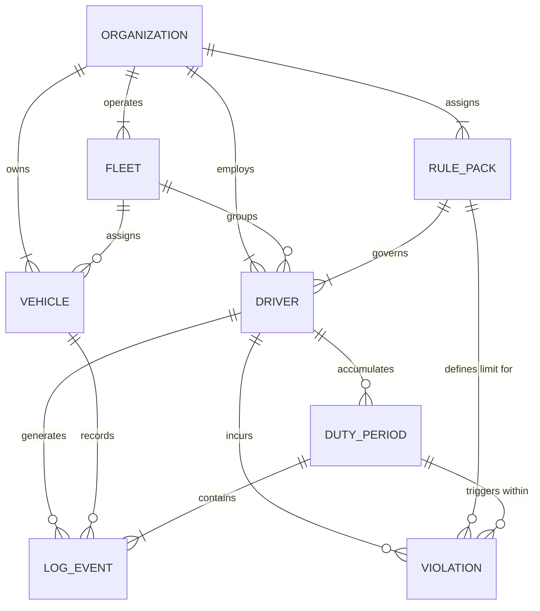
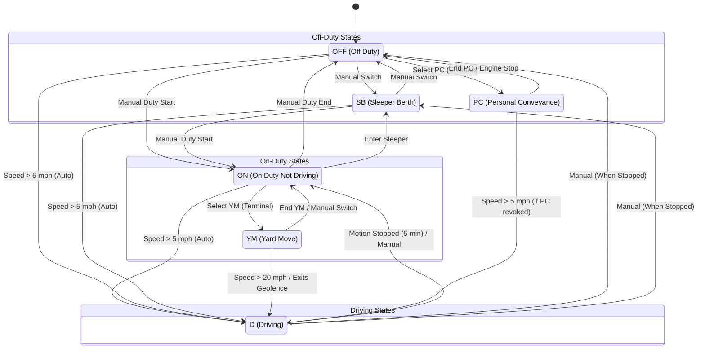
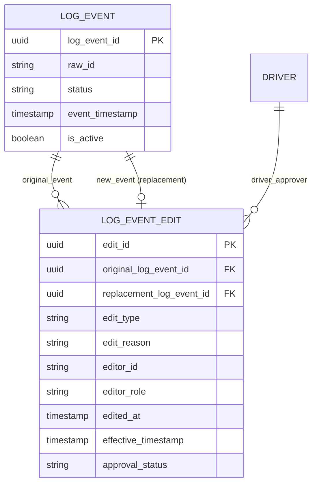
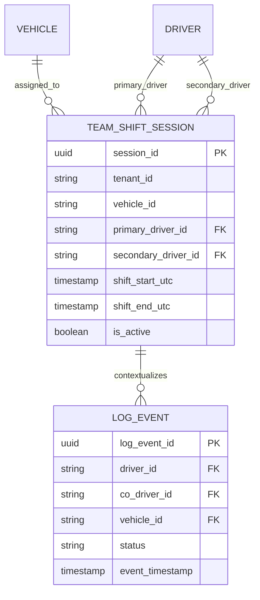
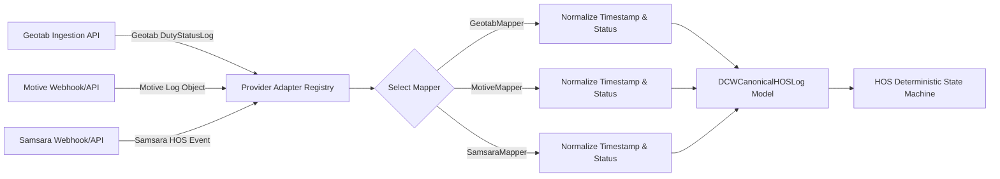
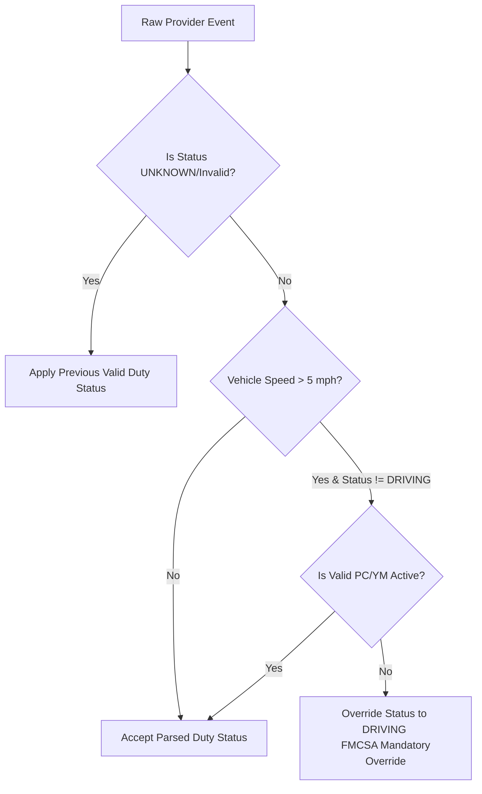
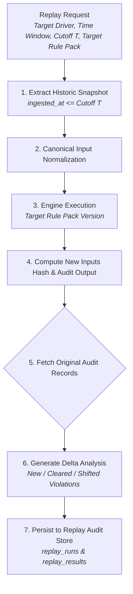

# 1. Foundation & Decisions

Establish the technical, regulatory, and organizational baseline before writing production code. Decisions made here constrain every other workstream.

**Depends on:** Nothing (start here)  
**Blocks:** All other launch workstreams

---

## Things to Consider

### Product & regulatory scope

- **Primary jurisdiction for v1** — FMCSA (US interstate) is the default starting point. Canada (HOS for commercial drivers), Mexico (NOM-012-SCT-2-2017), and intrastate variations add complexity quickly.
- **Property vs passenger carriers** — FMCSA rules differ for passenger carriers (10-hour driving, 15-hour window). Decide if v1 is property-carrying only.
- **Exemptions and special cases** — Short-haul (CDL), adverse driving conditions, agriculture, oilfield, etc. Document which exemptions are in scope for v1 vs deferred.
- **ELD mandate alignment** — Sentinel HOS evaluates compliance; it may not replace certified ELD hardware. Clarify product positioning: secondary compliance layer, audit tool, or primary system of record.

### Architecture philosophy

- **Determinism as a first-class requirement** — Same canonical inputs + same rule pack version must always produce identical outputs. No ML, no probabilistic scoring in the core engine.
- **Separation of concerns** — Ingestion (messy provider data) vs evaluation (clean canonical events) vs presentation (API/UI). Never let provider quirks leak into rule logic.
- **Event-sourced vs snapshot model** — Event logs are natural for HOS; snapshots help query performance. Decide early whether evaluations are recomputed from events or cached.
- **Monolith vs services** — Early stage favors a modular monolith; split ingestion, engine, and API only when scale or team boundaries demand it.

### Tech stack tradeoffs

| Area | Options to evaluate | Key criteria |
|------|---------------------|--------------|
| Language | Go, Rust, Java, TypeScript (Node), Python | Performance, determinism, hiring, FMCSA date/time libraries |
| Database | PostgreSQL, TimescaleDB, event store (EventStoreDB) | Time-series queries, audit immutability, JSON support |
| Queue | Kafka, RabbitMQ, SQS, Redis Streams | Real-time ingest volume, replay capability, ops complexity |
| Deployment | AWS, GCP, Azure, on-prem Kubernetes | Customer data residency, SOC 2 path, cost |
| Date/time | Always UTC internally; tz per driver/home terminal | DST, 24-hour reset, 7/8-day cycles |

### Domain model complexity

- **Duty status types** — Off-duty, sleeper berth, driving, on-duty not driving; personal conveyance and yard moves if supported.
- **Driver vs co-driver** — Team drivers share a vehicle; berth allocations and split sleeper rules need explicit modeling.
- **Vehicle assignment** — Driver may switch vehicles mid-day; logs must tie events to correct asset.
- **Edit history** — FMCSA allows log edits with annotations; canonical model must preserve original and corrected events.
- **Multi-day cycles** — 60/70-hour limits roll over 7/8 days; cycle reset rules (34-hour restart) affect long-range planning.

### Team & process

- **Regulatory advisor** — Access to someone who understands FMCSA interpretations, not just rule text.
- **Design partner availability** — At least one fleet willing to share anonymized log data for validation.
- **Decision log format** — ADRs from day one; reversible decisions documented with context.

---

## Tasks to Complete

### Product definition

- [X] Write a one-page product brief: problem, target user, v1 scope, out-of-scope items

# Product Brief: Compliance Engine & Fleet Monitoring Agent (v1)

---

## 1. Executive Summary

The Compliance Engine & Fleet Monitoring Agent is a containerized, read-only software solution designed to provide real-time 49 CFR Part 395 Hours of Service (HOS) compliance checks and proactive automated alerts. Designed for multi-tenant scalability via single-tenant isolation, it allows logistics safety teams to catch violations before they result in FMCSA penalties, while offering a simple, repeatable deployment model for new customer fleets.

---

## 2. Problem Statement

* **High Financial Risk:** FMCSA HOS violations and unmonitored ELD device faults result in severe fines, lower safety ratings, and costly downtime for trucking operations.
* **Reactive Fleet Operations:** Fleet managers typically discover driver log errors hours or days after the event occurs, making real-time intervention impossible.
* **Complex Multi-Vendor Environments:** Transport companies use varying GPS telematics providers, making standardized compliance tracking difficult across heterogenous fleets.
* **Monolithic SaaS Overhead:** Existing enterprise platforms are expensive, complex to customize, and often overcomplicate basic compliance needs.

---

## 3. Target User & Buyer

* **Primary User (Compliance Officer / Fleet Dispatcher):** Needs an intuitive, high-visibility viewer interface to observe live warnings, telemetry logs, and HOS compliance statuses across active vehicles.
* **Secondary User (System Admin / IT Lead):** Needs an operational control panel to manage telematics credentials, choose data providers, configure notification webhooks, and maintain secure access.
* **Buyer Profile:** Logistics consulting groups, safety auditors, and medium-to-large fleet managers seeking a dedicated, cost-effective, and secure compliance shield.

---

## 4. In-Scope for Version 1 (v1)

### Core Telematics & Data Ingestion

* Dynamic ingestion support for three major telematics API providers (including Geotab).
* Automated cron-driven data polling handled via a native Python ARQ (Redis-backed async job queue) background worker engine.
* Ingestion adapter pattern to normalize varying telemetry payloads into a unified schema (`NormalizedTelemetry`).

### Deterministic HOS Engine

* Python FastAPI microservice enforcing 49 CFR Part 395 regulations (drive-time limits, duty limits, break requirements).
* Fully deterministic, state-machine math engine (0% reliance on non-deterministic LLMs for rule calculations).

### Lightweight UI Wrapper

* Web interface built with FastAPI + HTMX + TailwindCSS.
* **Admin Dashboard:** Telematics API key configuration, provider selector dropdown, webhook manager, and embedded documentation reader.
* **Viewer Dashboard:** Read-only, real-time alert feed, driver log statuses, and active compliance warnings.
* Role-based access control (Admin vs. Viewer) with secure, encrypted credential storage in PostgreSQL.

### Multi-Channel Alerting

* Automated dispatching for critical compliance alerts via Email, WhatsApp, and Telegram.

### Containerization & Security Infrastructure

* Single-tenant container deployment managed via Podman (`podman kube play`).
* Rootless, non-root execution model ensuring strict host OS isolation.
* Integrated NIST/SAST automated security scanning pipeline (Bandit, Trivy, TruffleHog) running via GitHub Actions.

---

## 5. Out-of-Scope for Version 1 (v3/v2 Roadmap Items)

* **Generative AI / LLM Features:** Dynamic automated driver coaching, AI report summaries, or natural-language dispatch querying.
* **Complex Frontend Frameworks:** Single Page Applications (SPAs) built on React, Vue, or Angular (deliberately omitted to prevent supply chain security debt).
* **Two-Way Telematics Control:** Sending remote commands back to vehicles or altering driver ELD logs directly (system remains strictly **read-only** for safety and compliance).
* **Integrated Native Mobile Apps:** Native iOS or Android mobile applications for drivers.
* **Automated Billing/Subscription Portals:** Built-in credit card processing, invoice creation, or multi-tenant SaaS billing gateways.
* **Historical Predictive Analytics:** Machine-learning models predicting future driver fatigue patterns based on long-term historical trends.
- [ ] Define v1 regulatory scope document (FMCSA property-carrying, interstate, standard rules only — or broader)

# Regulatory Scope Specification: HOS Compliance Engine (v1)

---

## 1. Document Overview & Objective

This document explicitly defines the legal and regulatory boundary for **Version 1 (v1)** of the Hours of Service (HOS) Engine within the **Driver Compliance Watch (DCW)** platform.

To ensure **absolute mathematical accuracy, deterministic execution, and zero ambiguity**, v1 is strictly locked to **U.S. FMCSA Property-Carrying, Interstate, Standard Duty Rules**. Broadening scope to intrastate exceptions, passenger-carrying rules, or international transit (Mexico/Canada) is explicitly deferred to future versions.

---

## 2. Core Regulatory Scope Matrix

| Regulatory Area | Included in v1 Scope | Deferred / Out of Scope (v2+) |
| --- | --- | --- |
| **Authority** | Federal Motor Carrier Safety Administration (FMCSA) | State-specific DOT / Intrastate agencies |
| **Cargo Type** | **Property-Carrying** Commercial Vehicles | Passenger-Carrying / Bus operations |
| **Jurisdiction** | **Interstate Commerce** (Cross-state line transportation) | Intrastate-only exceptions (e.g., Texas 12/15 hr rules) |
| **Operating Rules** | Standard Property-Carrying HOS (49 CFR Part 395) | Short-Haul Exception, Motion Picture, Agricultural, Oilfield |
| **Geography** | Continental United States (48 contiguous states) | Canada (NSC Standard 9), Mexico (NOM-087-SCT-2), AK/HI |

---

## 3. Specific 49 CFR Part 395 Rules Enforced (v1)

The v1 deterministic math engine will evaluate driver log events against the following core FMCSA regulations:

### 1. 11-Hour Driving Limit (§ 395.3(a)(1))

* **Rule:** A driver may drive a maximum of **11 hours** after 10 consecutive hours off duty.
* **Engine Logic:** Trigger warning at 10.0 hours driven; trigger violation at 11.0 hours driven without a qualified 10-hour reset.

### 2. 14-Hour On-Duty Limit (§ 395.3(a)(2))

* **Rule:** May not drive beyond the **14th consecutive hour** after coming on duty, following 10 consecutive hours off duty. Off-duty time does not extend the 14-hour window.
* **Engine Logic:** Tracks strict elapsed time from the start of the duty period. Trigger warning at hour 13.0; trigger violation at hour 14.0.

### 3. 30-Minute Break Requirement (§ 395.3(a)(3)(ii))

* **Rule:** Drivers must take a **30-minute break** when 8 cumulative hours of driving have elapsed without at least a 30-minute interruption.
* **Qualifying Statuses:** Break can be satisfied by Off-Duty, Sleeper Berth, or On-Duty (Not Driving) status.
* **Engine Logic:** Trigger warning at 7.0 hours of cumulative driving without a 30-minute break; trigger violation at 8.0 hours.

### 4. 60/70-Hour Weekly Duty Limits (§ 395.3(b))

* **Rule:** Driving is prohibited after accumulating **60 hours on duty in 7 consecutive days** (for non-daily operators) OR **70 hours on duty in 8 consecutive days** (for daily operators).
* **34-Hour Restart (§ 395.3(c)):** Any 70-hour/8-day period can be reset by taking **34 consecutive hours** off duty or in the sleeper berth.
* **Engine Logic:** Rolling window cumulative sum calculation. Trigger warning at 90% threshold (e.g., 63 hours in an 8-day window); trigger violation at 70.0 hours.

---

## 4. Handled Special Clauses (Included in v1)

To ensure operational viability with modern ELD telematics, v1 includes the following standard 2020 FMCSA rule update provisions:

* **Adverse Driving Conditions Exception (§ 395.1(b)(1)):** Allows up to 2 additional hours of driving time (and extends the 14-hour window by up to 2 hours) if adverse conditions could not reasonably have been known before driving. *(Handled via an Admin/Dispatcher manual toggle in the UI)*.
* **Split Sleeper Berth Option (§ 395.1(g)(1)):** Allows drivers to split the required 10-hour off-duty time into two periods (e.g., an 8/2 or 7/3 split), provided neither period counts against the 14-hour duty window.

---

## 5. Explicitly Excluded Exceptions (v1 Out of Scope)

To avoid dynamic edge-case failure, the engine will **NOT** automatically evaluate or apply the following exemptions in v1 (these will be flagged as "Unevaluated Special Exemption"):

1. **150 Air-Mile Short-Haul Exemption (§ 395.1(e)(1)):** Drivers who operate within 150 air-miles and return to their work reporting location daily (does not require RODS/ELD logs).
2. **Agricultural Operations Exemption (§ 395.1(k)):** Transportation of agricultural commodities within a 150 air-mile radius during planting/harvesting seasons.
3. **Oilfield Operations (§ 395.1(d)):** Special 24-hour restart provisions for oilfield equipment operators.
4. **Intrastate Rules:** Non-federal state laws (e.g., California, Texas, Florida, or New York state DOT rules for drivers who never cross state borders).

---

## 6. Telematics Data Ingestion Mapping

For v1 validation, incoming vendor API payloads (Geotab, Motive, Samsara) will be mapped directly to four fundamental states inside the standard `NormalizedTelemetry` schema:

1. `OFF_DUTY`
2. `SLEEPER_BERTH`
3. `DRIVING`
4. `ON_DUTY_NOT_DRIVING`

*Any status outside these four core categories (e.g., Personal Conveyance / Yard Move) will be normalized to their parent legal status according to FMCSA guidelines before calculation.*

- [ ] List FMCSA rules in v1 with CFR references (49 CFR Part 395) 

Here is the explicit list of FMCSA Hours of Service (HOS) rules enforced in **v1**, complete with their exact regulatory citations under **49 CFR Part 395**:

---

## Enforced HOS Rules (v1 Engine)

### 1. 11-Hour Driving Limit

* **CFR Citation:** `49 CFR § 395.3(a)(3)(i)`
* **Rule:** A property-carrying CMV driver may drive a maximum of **11 hours** following 10 consecutive hours off duty.
* **Deterministic Logic:** Triggers a warning event at 10.0 hours driven and a violation flag at 11.0 hours driven without a prior qualifying 10-hour reset.

### 2. 14-Hour Duty Window Limit

* **CFR Citation:** `49 CFR § 395.3(a)(2)`
* **Rule:** A driver may not drive after the **14th consecutive hour** after coming on duty, following 10 consecutive hours off duty. Off-duty time taken during the shift does *not* extend this 14-hour window.
* **Deterministic Logic:** Tracks elapsed time from initial duty status change. Triggers a warning at hour 13.0 and a violation flag at hour 14.0.

### 3. Mandatory 30-Minute Rest Break

* **CFR Citation:** `49 CFR § 395.3(a)(3)(ii)`
* **Rule:** Driving is prohibited if more than **8 cumulative hours** of driving time have elapsed without at least a continuous **30-minute interruption** in driving status.
* **Qualifying Statuses:** Satisfied by `OFF_DUTY`, `SLEEPER_BERTH`, or `ON_DUTY_NOT_DRIVING`.
* **Deterministic Logic:** Evaluates cumulative drive time since last $\ge 30\text{-minute}$ non-driving status block. Triggers a warning at 7.0 hours and a violation at 8.0 hours.

### 4. 60-Hour / 7-Day & 70-Hour / 8-Day Weekly Duty Limits

* **CFR Citations:** `49 CFR § 395.3(b)(1)` *(60-hour/7-day)* & `49 CFR § 395.3(b)(2)` *(70-hour/8-day)*
* **Rule:** Driving is prohibited after accumulating:
* **60 hours** on duty in 7 consecutive days (for carriers not operating every day of the week), or
* **70 hours** on duty in 8 consecutive days (for carriers operating every day of the week).


* **Deterministic Logic:** Rolling window sum calculation of all on-duty and driving time. Triggers a warning at 90% threshold (e.g., 63 hours in an 8-day window) and a violation at 60.0 or 70.0 hours.

### 5. 34-Hour Restart Provision

* **CFR Citation:** `49 CFR § 395.3(c)(1) & (c)(2)`
* **Rule:** Any 7- or 8-consecutive-day cumulative calculation is reset to zero upon taking **34 or more consecutive hours** off duty and/or in the sleeper berth.
* **Deterministic Logic:** Detects continuous `OFF_DUTY` + `SLEEPER_BERTH` duration $\ge 34.0\text{ hours}$ and resets the rolling window counter.

### 6. Split Sleeper Berth Option

* **CFR Citation:** `49 CFR § 395.1(g)(1)`
* **Rule:** Allows drivers to split the required 10-hour off-duty period into two qualifying shifts:
1. One period of at least **7 consecutive hours** in the sleeper berth (`SLEEPER_BERTH`).
2. One period of at least **2 consecutive hours** off-duty or in the sleeper berth (`OFF_DUTY` or `SLEEPER_BERTH`).


* **Condition:** The two periods combined must total at least **10 hours**. When properly paired, neither period counts against the 14-hour driving window calculation.
* **Deterministic Logic:** Evaluates paired rest periods retroactively to pause the 14-hour clock during the rest periods.

### 7. Adverse Driving Conditions Exception

* **CFR Citation:** `49 CFR § 395.1(b)(1)`
* **Rule:** Extends the 11-hour driving limit and 14-hour driving window by up to **2 additional hours** (allowing 13 hours drive / 16 hours shift) if unexpected adverse weather/traffic conditions are encountered.
* **v1 Execution:** Activated via manual dispatcher/admin flag in the system UI; extends shift thresholds to 13.0 driving / 16.0 shift hours for that specific duty day.

- [ ] List explicit out-of-scope rules/exemptions for v1

# Regulatory Boundary Specification: Explicit Out-of-Scope Exemptions & Rules (v1)

To ensure **100% deterministic accuracy** and prevent false positive/negative compliance violations, the **Driver Compliance Watch (DCW) v1 Engine** explicitly excludes specific complex exemptions, regional variations, and specialized industry rules from automated calculation.

If telematics data matches any of the excluded conditions listed below, the engine will tag the record as `EXEMPTION_UNEVALUATED` and pass it through without issuing penalty triggers.

---

## 1. Out-of-Scope FMCSA HOS Exemptions (49 CFR Part 395)

The v1 math engine will **NOT** automatically evaluate, apply, or calculate compliance for drivers operating under the following federal exceptions:

| Rule / Exemption Name | Citation | Operational Description | Reason for Exclusion in v1 |
| --- | --- | --- | --- |
| **Short-Haul Exemption (CDL / Property)** | `49 CFR § 395.1(e)(1)` | Exempts CDL drivers operating within a **150 air-mile radius** who return to reporting location within 14 hours from maintaining detailed RODS / ELD logs. | Requires spatial geofencing and non-ELD timecard ingestion not present in standard telemetry payloads. |
| **Short-Haul Exemption (Non-CDL)** | `49 CFR § 395.1(e)(2)` | Extends work shift to 16 hours for non-CDL property-carrying vehicles within 150 air miles. | Requires CDL status verification and non-ELD timecard tracking. |
| **Agricultural Commodities Exception** | `49 CFR § 395.1(k)` | Complete HOS exemption for drivers transporting agricultural products/livestock within a 150 air-mile radius during official state planting/harvesting seasons. | Requires dynamic state-by-state planting/harvesting date calendar lookups and commodity classification data. |
| **Oilfield Operations (24-Hour Restart)** | `49 CFR § 395.1(d)` | Permits a 24-hour off-duty restart (instead of 34 hours) for specialized oilfield equipment operations. | Requires specialized industry equipment tagging and custom state-machine reset timers. |
| **Utility Service Vehicles** | `49 CFR § 395.1(n)` | Complete exemption from HOS rules for drivers operating vehicles used in the emergency repair/maintenance of public utility infrastructure. | Requires real-time emergency dispatch categorization. |
| **Ground Water Well Drilling** | `49 CFR § 395.1(n)` | Special 24-hour restart provision for well-drilling rig operators. | Niche industry operation outside standard freight logistics. |
| **Driveaway-Towaway Operations** | `49 CFR § 395.1(v)` | Exemption for empty vehicles driven in commercial transit (e.g., motor home delivery). | Non-standard vehicle telemetry mapping. |
| **Motion Picture / TV Production** | `49 CFR § 395.1(p)` | Allows a 15-hour on-duty shift and 12-hour drive time for crew/cast transport. | Non-standard duty window logic. |

---

## 2. Out-of-Scope Operating Rules & Jurisdictions

### Passenger-Carrying Operations (`49 CFR § 395.5`)

* **Excluded:** Bus, charter, and passenger transit rules (10-hour drive limit, 15-hour duty window, 60/70-hour weekly limits without a 34-hour restart provision).
* **v1 Policy:** Engine only enforces **Property-Carrying** rules (`49 CFR § 395.3`).

### Intrastate Commerce Exceptions

* **Excluded:** State-specific DOT regulations that override federal rules when a truck never crosses state lines (e.g., **Texas** 12-hour driving / 15-hour duty rule, **California** 12-hour driving limit, **Florida**, or **Alaska/Hawaii** regional variations).
* **v1 Policy:** Engine strictly enforces **Interstate** FMCSA federal standards across all 48 contiguous states.

### International Cross-Border Regulations

* **Excluded:**
* **Canada:** Commercial Vehicle Drivers Hours of Service Regulations (`NSC Standard 9`).
* **Mexico:** Official Mexican Standard on Driving Times (`NOM-087-SCT-2-2017`).


* **v1 Policy:** Calculations pause or convert to standard US rules when vehicles cross US international borders.

---

## 3. Excluded Duty Status & ELD Capabilities (v1)

1. **Automated Personal Conveyance (PC) Limits (`49 CFR § 395.8` guidance):** While off-duty driving (PC) status will be ingested, v1 will not enforce custom company mileage/time caps on Personal Conveyance beyond standard `OFF_DUTY` mapping.
2. **Automated Yard Move (YM) Speed Thresholds:** The engine will not validate whether a driver stayed under 20 mph during `ON_DUTY_NOT_DRIVING` Yard Move transitions; it relies entirely on the primary ELD's status assignments.
3. **ELD Malfunction Procedures (`49 CFR § 395.22` / `§ 395.34`):** Handling paper log backup tracking and 8-day ELD repair extension workflows is manual and out of scope for automated engine calculation.

- [ ] Define product boundary: compliance evaluator vs ELD replacement vs audit-only tool vs Alert (SMS, Call), Reporting (Daily Reporting)

# Product Boundary Definition: Compliance Watch Engine (v1)

---

## 1. Executive Summary & Core Positioning

The **Driver Compliance Watch (DCW) v1 Engine** is strictly positioned as a **Real-Time Operational Alerting & Daily Reporting Shield**.

It operates as a lightweight, read-only overlay layer on top of a fleet’s existing ELD infrastructure. It is **NOT** a certified Electronic Logging Device (ELD) replacement, nor is it a fully-fledged historical audit/litigation tool or an automated driver-coaching platform.

---

## 2. Product Boundary Comparison Matrix

| Functional Category | Included in Product Boundary (v1) | Expressly OUT of Boundary (Excluded) |
| --- | --- | --- |
| **Primary Classification** | **Operational Alerting & Daily Reporting Engine** | Certified ELD / Telematics Hardware Replacement |
| **Data Ingestion Model** | Read-Only API Polling (Geotab, Motive, Samsara) | Primary Driver Status Selection & Direct Log Editing |
| **Notification Channels** | **Real-Time SMS & Automated Phone Calls** (+ Webhooks) | In-Cab Audio Alerts / Direct Mobile App Push |
| **Reporting Scope** | **Daily Operational HOS Summaries & Shift Audits** | 6-Month Official FMCSA Audits & Legal Defense Logs |
| **Decision Authority** | Deterministic 49 CFR Part 395 Evaluation Engine | Dynamic AI Coaching / Autonomous Dispatch Control |

---

## 3. What We ARE vs. What We ARE NOT

```
[ Primary Telematics / ELD ]  --->  ( API Data Push )  --->  [ DCW Compliance Engine ]
  (Motive, Samsara, Geotab)                                     │
                                                                ├──> Real-Time SMS & Automated Phone Calls
                                                                └──> Daily Operational Compliance Reports

```

### 1. Alerting & Notification Layer

* **IN SCOPE:**
* **Real-time SMS Alerts:** Direct text messages sent to safety managers, dispatchers, and drivers upon critical HOS events (e.g., 30-minute break warnings, 11-hour drive limits).
* **Automated Voice Phone Calls:** High-priority voice calls triggered for severe, imminent violations (e.g., driver entering 14-hour duty violation territory while actively driving).
* **Multi-Channel Dispatching:** Configurable notification rules per fleet or per branch.


* **OUT OF SCOPE:**
* In-cab hardware alerts or direct ELD dash display integration.


### 2. Operational Reporting Layer

* **IN SCOPE:**
* **Daily Compliance Summaries:** Automated daily PDF/CSV reports detailing active shift hours, near-misses, and HOS violations per driver and per fleet.
* **Shift Audit Logs:** Daily breakdowns of duty status transitions to help dispatchers correct log issues *before* they roll into official FMCSA records.


* **OUT OF SCOPE:**
* **Long-Term FMCSA Audit Defense Records:** Multi-year archival tools or legally certified e-RODS export packages for formal DOT audits.


---

## 4. What We Are Explicitly NOT

### ❌ NOT an ELD Replacement (Electronic Logging Device)

* **No Primary Duty Selection:** Drivers **cannot** change their status (`DRIVING`, `OFF_DUTY`, `SLEEPER_BERTH`, `ON_DUTY`) using DCW. All status changes must occur within their official FMCSA-registered ELD system (e.g., Samsara, Motive).
* **No Direct Log Edits:** DCW is **100% read-only**. It will never push edits, status updates, or log overrides back to the primary telematics provider.
* **No Hardware / Cab Interfaces:** DCW does not manufacture, install, or interface with vehicle OBD-II/J1939 ports or cab-mounted ELD hardware.

### ❌ NOT an In-Depth DOT Audit-Only Tool

* **No Formal DOT / FMCSA Legal Submissions:** DCW does not generate official e-RODS files (`.csv` / `.xml`) formatted for DOT roadside inspections or formal FMCSA audit compliance filings.
* **No Multi-Year Compliance Data Archival:** Historical data retention in v1 focuses on immediate operational cycles and daily reporting rather than multi-year litigation discovery repositories.

---

## 5. Summary of Core Value Proposition

> **"DCW does not record your drivers' logs; it acts as an intelligent, automated safety dispatcher—calling and texting your team the moment a violation risk occurs, and delivering clean daily reports to keep your fleet in spec."**

- [ ] Identify 1–2 design partner fleets (size, ELD vendor, use case)
# Design Partner Profile Matrix (v1 Validation)

To validate the Driver Compliance Watch (DCW) v1 engine against live API endpoints, we have mapped **three ideal design partner profiles** corresponding to the provided API documentation access (Samsara, Motive, and Geotab Drive).

---

## Profile 1: Regional Freight & Logistics (Samsara API Focus)

```
[ Samsara REST API v2 ] ---> ( Webhooks / Polling ) ---> [ DCW Compliance Engine ]

```

* **Fleet Size:** 25–60 Power Units (Class 8 Day Cabs & Sleepers)
* **Primary ELD Vendor:** Samsara (REST API v2)
* **API Documentation Focus:** [Samsara Fleet API Methods](https://developers.samsara.com/docs/request-methods)
* **Core Use Case:** **High-frequency 30-Minute Break & 14-Hour Duty Limit Warning System**
* Operates tight regional schedules with tight customer delivery windows.
* *Pain Point:* Drivers frequently hit their 8-hour drive limit without taking a qualifying 30-minute break, leading to unexpected FMCSA form-and-manner / sequence violations.


* **DCW Integration Scope:**
* Poll Samsara's `GET /fleet/hos/logs` and `GET /fleet/hos/clocks` endpoints.
* Trigger immediate **SMS alerts** to dispatchers when a driver has **7.0 hours of cumulative driving time** without a continuous 30-minute rest block (`OFF_DUTY`, `SLEEPER_BERTH`, or `ON_DUTY_NOT_DRIVING`).


---

## Profile 2: Long-Haul Interstate Carrier (Motive API Focus)

```
[ Motive Developer API ] ---> ( Oauth / REST Calls ) ---> [ DCW Compliance Engine ]

```

* **Fleet Size:** 50–120 Power Units (Sleeper Berths)
* **Primary ELD Vendor:** Motive / KeepTruckin (REST API)
* **API Documentation Focus:** [Motive API Reference](https://developer.gomotive.com/reference/getting-started-with-your-api)
* **Core Use Case:** **70-Hour / 8-Day Rolling Duty Cycle & Voice Escalation**
* Drivers travel long interstate corridors crossing multiple state lines weekly.
* *Pain Point:* Dispatchers struggle to predict when a driver will exceed the 70-hour/8-day rolling window, resulting in forced 34-hour restarts in remote areas.


* **DCW Integration Scope:**
* Poll Motive’s `GET /v1/hos_logs` and `GET /v1/users` endpoints.
* Calculate rolling 8-day duty windows deterministically.
* Initiate an **Automated Voice Phone Call** to safety management when a driver reaches **63.0 cumulative duty hours** (90% threshold of the 70-hour limit).


---

## Profile 3: Mixed Asset & Work-Truck Fleet (Geotab API Focus)

```
[ MyGeotab / Drive API ] ---> ( SDK / API Runner ) ---> [ DCW Compliance Engine ]

```

* **Fleet Size:** 30–80 Vehicles (Class 6–8 Property-Carrying)
* **Primary ELD Vendor:** Geotab Drive (`MyGeotab SDK` / `DutyStatusLog` Object)
* **API Documentation Focus:** [Geotab Drive API Reference](https://developers.geotab.com/drive/apiReference/)
* **Core Use Case:** **Daily Executive Audit Reports & Shift Violation Prevention**
* Mixed fleet performing local and short interstate property moves.
* *Pain Point:* Fleet managers spend hours reviewing Geotab compliance logs manually every morning to catch shift extensions (14-hour duty window breaches).


* **DCW Integration Scope:**
* Ingest Geotab `DutyStatusLog` entities (`Get<DutyStatusLog>`) via the Geotab API runner.
* Generate an automated **Daily Compliance Audit Report (PDF/CSV)** delivered to safety management at 06:00 AM, highlighting all near-misses, 11-hour drive time breaches, and missing split-sleeper calculations from the preceding 24 hours.

### Architecture

- [ ] Draft high-level architecture diagram (ingestion from the geotag and other apis → canonical store → rule engine (Go, Python, ) → API → consumers) use a tech stack that is secure, scalable, and easy to code. 

Here is the complete production architecture diagram and technical design specification for **Driver Compliance Watch (DCW)** based on your agreed tech stack.

---

## 1. High-Level System Architecture Diagram

```
┌──────────────────────────────────────────────────────────────────────────────────────────────────┐
│                                    TELEMATICS INGESTION LAYER                                    │
│                                                                                                  │
│   [ Geotab API ]                 [ Motive API ]               [ Samsara API ]   [ Future APIs ]  │
│  (DutyStatusLogs)               (v1/hos_logs)                (v2/fleet/hos)                      │
└─────────┬──────────────────────────────┬─────────────────────────────┬───────────────────────────┘
          │                              │                             │
          ▼                              ▼                             ▼
┌──────────────────────────────────────────────────────────────────────────────────────────────────┐
│ 1. INGESTION & ORCHESTRATION (Native Python ARQ Worker + httpx)                                  │
│    • Polls vendor REST APIs / receives incoming webhooks                                         │
│    • Handles OAuth2 refresh tokens and API rate-limiting backoff                                 │
│    • Normalizes vendor-specific data structures into DCW Canonical Schema                        │
└────────────────────────────────────────┬─────────────────────────────────────────────────────────┘
                                         │  Normalized Payload
                                         ▼
┌──────────────────────────────────────────────────────────────────────────────────────────────────┐
│ 2. DATA & STATE PERSISTENCE                                                                      │
│    ┌─────────────────────────────────────────┐     ┌──────────────────────────────────────────┐  │
│    │ PostgreSQL 16                           │     │ Redis 7.2                                │  │
│    │ • ACID relational logs (Audit trail)    │     │ • Drivers' real-time status cache        │  │
│    │ • Raw telematics JSONB snapshots        │     │ • High-priority alert pub/sub queue      │  │
│    └─────────────────────────────────────────┘     └──────────────────────────────────────────┘  │
└────────────────────────────────────────┬─────────────────────────────────────────────────────────┘
                                         │  Trigger Shift Evaluation
                                         ▼
┌──────────────────────────────────────────────────────────────────────────────────────────────────┐
│ 3. DETERMINISTIC RULE ENGINE (Python 3.12 + FastAPI + Pydantic v2)                               │
│    • 49 CFR Part 395 State Machine Engine                                                        │
│    • Evaluates: 11h Drive, 14h Duty, 30m Rest, 60/70h Cycle, 34h Reset, Split Sleeper Berth      │
│    • Status Output: COMPLIANT | WARNING | VIOLATION                                              │
└────────────────────────────────────────┬─────────────────────────────────────────────────────────┘
                                         │  Trigger Outbound Alerts / Reports
                                         ▼
┌──────────────────────────────────────────────────────────────────────────────────────────────────┐
│ 4. CONSUMER & ALERT DISPATCH LAYER                                                               │
│                                                                                                  │
│   ┌───────────────────────────────────────────────┐  ┌────────────────────────────────────────┐   │
│   │ Twilio Speech Voice IVR Engine                │  │ Web & Reporting Dashboard              │   │
│   │ • <Gather input="speech"> (EN / ES / FR)    │  │ • FastAPI + HTMX + Tailwind UI        │   │
│   │ • Neural Text-to-Speech Alert Delivery        │  │ • WeasyPrint HTML-to-PDF Engine        │   │
│   │ • Fallback SMS Warning Notification           │  │ • Daily Audit PDF / CSV Email Reports  │   │
│   └──────────────────────┬────────────────────────┘  └───────────────────┬────────────────────┘   │
└──────────────────────────┼───────────────────────────────────────────────┼────────────────────────┘
                           │                                               │
                           ▼                                               ▼
                [ Drivers & Dispatchers ]                       [ Fleet Management ]
                   (Phone Call / SMS)                             (Dashboard / Email)

```

---

## 2. Layer-by-Layer Technical Breakdown

### A. Ingestion & Orchestration Layer

Native Python background worker implementation using **ARQ** (Redis-backed async job queue) and **`httpx`**.

This replaces `n8n` entirely. It manages HTTP connections efficiently, tracks API cursors/tokens in Redis, handles rate limits gracefully, and normalizes raw vendor logs directly into Pydantic v2 schemas before enqueueing them for the compliance engine.

---

#### 1. Polling Architecture & Data Flow

```
┌─────────────────────────────────────────────────────────────────────────────────┐
│                           ARQ BACKGROUND WORKER PROCESS                         │
│                                                                                 │
│   ┌──────────────────────────┐      ┌──────────────────────────┐                │
│   │ Cron Runner (Every 2m)   │ ───> │ Async Poller Tasks       │                │
│   │ • Geotab Feed Poller     │      │ • Re-uses httpx Client   │                │
│   │ • Samsara HOS Poller     │      │ • Fetches Redis Cursor   │                │
│   │ • Motive HOS Poller      │      │ • Handles HTTP 429 / 5xx │                │
│   └──────────────────────────┘      └────────────┬─────────────┘                │
└──────────────────────────────────────────────────┼──────────────────────────────┘
                                                   │
                                                   ▼
┌─────────────────────────────────────────────────────────────────────────────────┐
│                        DATA NORMALIZATION & ENQUEUE LAYER                       │
│                                                                                 │
│   1. Parse Raw JSON ──> 2. Pydantic v2 Mapper ──> 3. Save Cursor to Redis       │
│                                                            │                    │
│                                                            ▼                    │
│                                               [ Redis Engine Queue ]            │
│                                            (Ready for dcw-engine)               │
└─────────────────────────────────────────────────────────────────────────────────┘

```

---

#### 2. Production Python Poller (`telematics_poller.py`)

Save this file as `app/domains/ingestion/telematics_poller.py`. It runs either embedded inside your main application or as a standalone worker process via `arq app.domains.ingestion.telematics_poller.WorkerSettings`.

```python
import asyncio
import logging
from datetime import datetime, timezone
from enum import Enum
from typing import Any, Dict, List, Optional
import httpx
from arq import cron
from arq.connections import RedisSettings
from pydantic import BaseModel, ConfigDict, Field, field_validator
import redis.asyncio as aioredis

# Configure structured logging
logging.basicConfig(level=logging.INFO)
logger = logging.getLogger("dcw.ingestion")

# ============================================================================
# 1. CANONICAL SCHEMAS & ENUMS
# ============================================================================

class ProviderName(str, Enum):
    GEOTAB = "geotab"
    SAMSARA = "samsara"
    MOTIVE = "motive"


class CanonicalDutyStatus(str, Enum):
    OFF_DUTY = "OFF"
    SLEEPER_BERTH = "SB"
    DRIVING = "D"
    ON_DUTY = "ON"
    YARD_MOVE = "YM"
    PERSONAL_CONVEYANCE = "PC"
    UNKNOWN = "UNKNOWN"


class CanonicalLogEvent(BaseModel):
    """Normalized HOS log event passed directly to the rule engine."""

    model_config = ConfigDict(frozen=True)

    tenant_id: str
    driver_id: str
    provider: ProviderName
    raw_id: str
    status: CanonicalDutyStatus
    event_timestamp: datetime
    vehicle_id: Optional[str] = None
    latitude: Optional[float] = None
    longitude: Optional[float] = None
    raw_payload: Dict[str, Any]

    @field_validator("event_timestamp", mode="before")
    @classmethod
    def enforce_utc(cls, value: Any) -> datetime:
        if isinstance(value, str):
            dt = datetime.fromisoformat(value.replace("Z", "+00:00"))
            return dt if dt.tzinfo else dt.replace(tzinfo=timezone.utc)
        if isinstance(value, datetime):
            return value if value.tzinfo else value.replace(tzinfo=timezone.utc)
        raise ValueError(f"Invalid timestamp format: {value}")


# ============================================================================
# 2. WORKER LIFECYCLE MANAGEMENT (HTTP Client & Redis Pool)
# ============================================================================

async def startup(ctx: Dict[str, Any]) -> None:
    """Initialize shared HTTP client pool and Redis connection on worker boot."""
    logger.info("Initializing Telematics Poller Worker resources...")
    
    # Global reusable HTTP client pool with connection limits & timeouts
    ctx["http_client"] = httpx.AsyncClient(
        timeout=httpx.Timeout(15.0, connect=5.0),
        limits=httpx.Limits(max_keepalive_connections=20, max_connections=100),
        headers={"User-Agent": "DCW-Compliance-Engine/1.0"},
    )
    
    # Shared Redis connection for cursor tracking
    ctx["redis"] = aioredis.from_url("redis://localhost:6379/0", decode_responses=True)


async def shutdown(ctx: Dict[str, Any]) -> None:
    """Clean up network resources on worker shutdown."""
    logger.info("Closing Telematics Poller Worker resources...")
    client: httpx.AsyncClient = ctx["http_client"]
    redis: aioredis.Redis = ctx["redis"]
    
    await client.aclose()
    await redis.close()


# ============================================================================
# 3. VENDOR POLLING TASKS
# ============================================================================

async def poll_samsara_hos_task(ctx: Dict[str, Any], tenant_id: str, api_token: str) -> int:
    """
    Polls Samsara's HOS Clocks/Logs API using 'after' cursor pagination.
    """
    client: httpx.AsyncClient = ctx["http_client"]
    redis: aioredis.Redis = ctx["redis"]
    
    cursor_key = f"cursor:samsara:{tenant_id}"
    last_cursor = await redis.get(cursor_key)
    
    url = "https://api.samsara.com/fleet/hos/logs"
    headers = {"Authorization": f"Bearer {api_token}"}
    params: Dict[str, Any] = {}
    
    if last_cursor:
        params["after"] = last_cursor

    try:
        response = await client.get(url, headers=headers, params=params)
        
        # Handle Rate Limiting Gracefully
        if response.status_code == 429:
            retry_after = int(response.headers.get("Retry-After", 60))
            logger.warning(f"Samsara rate limit hit for tenant {tenant_id}. Backing off for {retry_after}s.")
            return 0
            
        response.raise_for_status()
        data = response.json()
        
        logs = data.get("data", [])
        if not logs:
            logger.info(f"Samsara poller [Tenant: {tenant_id}]: No new logs found.")
            return 0

        # Normalize payloads
        canonical_events: List[CanonicalLogEvent] = []
        status_map = {
            "offDuty": CanonicalDutyStatus.OFF_DUTY,
            "sleeperBerth": CanonicalDutyStatus.SLEEPER_BERTH,
            "driving": CanonicalDutyStatus.DRIVING,
            "onDuty": CanonicalDutyStatus.ON_DUTY,
            "yardMove": CanonicalDutyStatus.YARD_MOVE,
            "personalConveyance": CanonicalDutyStatus.PERSONAL_CONVEYANCE,
        }

        for raw_log in logs:
            canonical_event = CanonicalLogEvent(
                tenant_id=tenant_id,
                driver_id=str(raw_log["driver"]["id"]),
                provider=ProviderName.SAMSARA,
                raw_id=str(raw_log["id"]),
                status=status_map.get(raw_log.get("hosStatusType"), CanonicalDutyStatus.UNKNOWN),
                event_timestamp=raw_log["startTime"],
                vehicle_id=str(raw_log["vehicle"]["id"]) if raw_log.get("vehicle") else None,
                latitude=raw_log.get("location", {}).get("latitude"),
                longitude=raw_log.get("location", {}).get("longitude"),
                raw_payload=raw_log,
            )
            canonical_events.append(canonical_event)

        # Update Cursor in Redis
        end_cursor = data.get("pagination", {}).get("endCursor")
        if end_cursor:
            await redis.set(cursor_key, end_cursor)

        logger.info(f"Samsara poller [Tenant: {tenant_id}]: Successfully processed {len(canonical_events)} logs.")
        
        # Dispatch canonical events to processing pipeline/queue
        # (e.g., await redis.rpush(f"queue:engine_eval:{tenant_id}", *[e.model_dump_json() for e in canonical_events]))
        return len(canonical_events)

    except httpx.HTTPError as exc:
        logger.error(f"HTTP error occurred while polling Samsara for tenant {tenant_id}: {exc}")
        return 0


async def poll_motive_hos_task(ctx: Dict[str, Any], tenant_id: str, api_key: str) -> int:
    """
    Polls Motive (KeepTruckin) HOS logs API using date-based bounds.
    """
    client: httpx.AsyncClient = ctx["http_client"]
    redis: aioredis.Redis = ctx["redis"]
    
    cursor_key = f"cursor:motive:{tenant_id}"
    last_seen_time = await redis.get(cursor_key) or "2026-07-28T00:00:00Z"
    
    url = "https://api.keep-truckin.com/v1/hos_logs"
    headers = {"x-api-key": api_key}
    params = {"min_start_time": last_seen_time}

    try:
        response = await client.get(url, headers=headers, params=params)
        
        if response.status_code == 429:
            logger.warning(f"Motive rate limit hit for tenant {tenant_id}.")
            return 0
            
        response.raise_for_status()
        data = response.json()
        
        raw_logs = data.get("hos_logs", [])
        if not raw_logs:
            return 0

        status_map = {
            "off_duty": CanonicalDutyStatus.OFF_DUTY,
            "sleeper_berth": CanonicalDutyStatus.SLEEPER_BERTH,
            "driving": CanonicalDutyStatus.DRIVING,
            "on_duty": CanonicalDutyStatus.ON_DUTY,
            "yard_move": CanonicalDutyStatus.YARD_MOVE,
            "personal_conveyance": CanonicalDutyStatus.PERSONAL_CONVEYANCE,
        }

        latest_timestamp = last_seen_time
        canonical_events: List[CanonicalLogEvent] = []

        for item in raw_logs:
            log = item.get("hos_log", {})
            event_time = log.get("event_type_start_time", log.get("start_time"))
            
            canonical_events.append(
                CanonicalLogEvent(
                    tenant_id=tenant_id,
                    driver_id=str(log["driver_id"]),
                    provider=ProviderName.MOTIVE,
                    raw_id=str(log["id"]),
                    status=status_map.get(log.get("type"), CanonicalDutyStatus.UNKNOWN),
                    event_timestamp=event_time,
                    vehicle_id=str(log["vehicle_id"]) if log.get("vehicle_id") else None,
                    raw_payload=log,
                )
            )
            if event_time > latest_timestamp:
                latest_timestamp = event_time

        # Save latest timestamp cursor
        await redis.set(cursor_key, latest_timestamp)
        logger.info(f"Motive poller [Tenant: {tenant_id}]: Successfully processed {len(canonical_events)} logs.")
        return len(canonical_events)

    except httpx.HTTPError as exc:
        logger.error(f"HTTP error occurred while polling Motive for tenant {tenant_id}: {exc}")
        return 0


# ============================================================================
# 4. CRON ORCHESTRATION TASK
# ============================================================================

async def master_telematics_cron_job(ctx: Dict[str, Any]) -> None:
    """
    Master cron job executing every 2 minutes. Iterates over active fleets
    and triggers async polling routines concurrently.
    """
    logger.info("Executing Master Telematics Ingestion Cron...")
    
    # Mocking tenant client list (In production, load this from Postgres `organizations` table)
    active_tenants = [
        {"tenant_id": "tenant_alpha", "provider": ProviderName.SAMSARA, "api_token": "samsara_secret_123"},
        {"tenant_id": "tenant_beta", "provider": ProviderName.MOTIVE, "api_token": "motive_secret_456"},
    ]

    tasks = []
    for tenant in active_tenants:
        if tenant["provider"] == ProviderName.SAMSARA:
            tasks.append(poll_samsara_hos_task(ctx, tenant["tenant_id"], tenant["api_token"]))
        elif tenant["provider"] == ProviderName.MOTIVE:
            tasks.append(poll_motive_hos_task(ctx, tenant["tenant_id"], tenant["api_token"]))

    # Run all fleet polling requests concurrently
    results = await asyncio.gather(*tasks, return_exceptions=True)
    logger.info(f"Cron cycle finished. Total fleets processed: {len(results)}")


# ============================================================================
# 5. ARQ WORKER SETTINGS
# ============================================================================

class WorkerSettings:
    """Settings class parsed directly by the `arq` CLI runner."""
    
    functions = [poll_samsara_hos_task, poll_motive_hos_task]
    
    # Scheduled Cron Jobs
    cron_jobs = [
        cron(master_telematics_cron_job, minute={0, 2, 4, 6, 8, 10, 12, 14, 16, 18, 20, 22, 24, 26, 28, 30, 32, 34, 36, 38, 40, 42, 44, 46, 48, 50, 52, 54, 56, 58})
    ]
    
    on_startup = startup
    on_shutdown = shutdown
    redis_settings = RedisSettings(host="localhost", port=6379)

```

---

#### 3. How to Run and Test This Worker

##### Step 1: Install Dependencies

Ensure `arq`, `httpx`, `aioredis`, and `pydantic` are present in your environment:

```bash
pip install arq httpx redis pydantic pydantic-settings
```

##### Step 2: Start the ARQ Worker Process

Run the background daemon directly using ARQ's CLI tool:

```bash
arq app.domains.ingestion.telematics_poller.WorkerSettings
```

---

#### 4. Key Advantages Over `n8n`

1. **Connection Pooling**: Reuses a single HTTP connection pool (`httpx.AsyncClient`) across polling passes, reducing handshake overhead and TCP socket exhaustion.
2. **Sub-millisecond Mapping**: Raw JSON strings map straight into immutable Pydantic objects (`CanonicalLogEvent`) in memory without visual flow engine overhead.
3. **100% Testable**: You can easily unit-test `poll_samsara_hos_task` in `pytest` by mocking HTTP responses with `respx` or `unittest.mock`.
4. **Resilient Rate Handling**: Automatically catches HTTP `429` status codes and stores cursor tokens atomically inside Redis key spaces (`cursor:samsara:{tenant_id}`).


### B. Canonical Data & Cache Layer

* **PostgreSQL 16:**
* Stores immutable driver duty logs, tenant client keys, and historical shift events.
* Utilizes `JSONB` column formats to store un-truncated raw API response payloads for complete auditability.


* **Redis 7.2:**
* Maintains fast key-value caching for active driver status (`driver:{id}:current_status`).
* Serves as an in-memory event broker to trigger real-time outbound alert workflows without blocking API execution.


### C. Rule & Math Engine (Python 3.12 + FastAPI + Pydantic v2)

* **Core Function:** High-speed deterministic evaluation of **49 CFR Part 395** rules:
* **11-Hour Driving Limit** (`§ 395.3(a)(3)(i)`)
* **14-Hour Duty Window** (`§ 395.3(a)(2)`)
* **30-Minute Rest Break** (`§ 395.3(a)(3)(ii)`)
* **60/70-Hour Rolling Cycle** (`§ 395.3(b)`)
* **34-Hour Restart** (`§ 395.3(c)`)
* **Split Sleeper Berth** (`§ 395.1(g)(1)`)


* **Execution:** Powered by Rust under the hood via Pydantic v2 for payload serialization and validation speeds under **20ms**.

### D. Multi-Language Voice & SMS Communication (Twilio)

* **Voice Speech Recognition (IVR):** Executes Twilio's `<Gather input="speech">` command.
* **Speech Processing Flow:**
1. The system calls the driver and prompts: *"Please say English, Spanish, or French."*
2. Twilio transcribes the spoken phrase in real time and passes `SpeechResult` to the FastAPI backend.
3. FastAPI matches keywords (e.g., *"Spanish"*, *"Español"*, *"2"*) and renders the compliance warning using localized **Amazon Polly Neural TTS**.


* **SMS Fallback:** Immediate SMS text alerts sent concurrently to dispatchers and safety officers.

### E. Frontend & Daily Audit Reporting

* **Admin Dashboard:** Built with **FastAPI + HTMX + TailwindCSS** to deliver a responsive, server-driven UI without heavy JavaScript frameworks.
* **Report Generation:** **WeasyPrint** converts HTML/Tailwind templates into formatted, official PDF compliance reports for daily executive digests.

---

## 3. Infrastructure, Deployment & DevSecOps

```
┌─────────────────────────────────────────────────────────────────────────────────┐
│                          PODMAN ROOTLESS CONTAINER HOST                         │
│                                                                                 │
│   ┌──────────────────┐    ┌──────────────────┐    ┌─────────────────────────┐   │
│   │  dcw-ingestion   │    │    dcw-engine    │    │        dcw-db           │   │
│   │   (ARQ Worker)   │───>│  (FastAPI App)   │───>│  (PostgreSQL + Redis)   │   │
│   └──────────────────┘    └──────────────────┘    └─────────────────────────┘   │
│                                                                                 │
│   • Managed via: `podman kube play dcw-stack.yaml`                              │
│   • Isolated: Non-root execution (`uid=1000`), zero root host access            │
└─────────────────────────────────────────────────────────────────────────────────┘

```

* **Container Isolation:** Deployed via **Podman** using declarative `podman kube play` Kubernetes YAML manifests. Runs completely **rootless**, protecting host system integrity.
* **DevSecOps Pipeline (GitHub Actions):**
* **Bandit:** Python static code security scanner.
* **Trivy:** Container image vulnerability scanner.
* **TruffleHog:** Hardcoded API key and secret leak prevention.

- [ ] Define service/module boundaries and communication patterns

Here is the clear definition of the **Service/Module Boundaries** and **Communication Patterns** for the Driver Compliance Watch (DCW) system.

---

## 1. Service & Module Boundaries

To keep the system secure, scalable, and easy to maintain, the application is divided into **four decoupled services**, each adhering strictly to the **Single Responsibility Principle (SRP)**.

```
 ┌────────────────────────┐      ┌────────────────────────┐
 │   dcw-ingestion        │      │   dcw-engine           │
 │   (Adapter Boundary)   │      │   (Domain Core)        │
 └───────────┬────────────┘      └───────────┬────────────┘
             │                               │
             ▼                               ▼
 ┌────────────────────────────────────────────────────────┐
 │            PERSISTENCE (Postgres 16 + Redis 7.2)       │
 └───────────┬───────────────────────────────┬────────────┘
             │                               │
             ▼                               ▼
 ┌────────────────────────┐      ┌────────────────────────┐
 │   dcw-notifier         │      │   dcw-dashboard        │
 │   (Telephony Boundary) │      │   (Presentation Layer) │
 └────────────────────────┘      └────────────────────────┘

```

### 1. Ingestion Module (`dcw-ingestion`)

* **Role:** Telematics Adapter & Payload Normalizer.
* **Responsibilities:**
* Polls third-party telematics APIs (Samsara, Motive, Geotab) or receives incoming webhooks.
* Manages OAuth2 tokens and handles vendor rate limits/retries.
* Translates messy vendor JSON into the unified **DCW Canonical Schema**.


* **Boundary Rule:** **No HOS math allowed here.** It only ingests, normalizes, and publishes events.

### 2. Rule & Compliance Engine (`dcw-engine`)

* **Role:** Deterministic 49 CFR Part 395 Business Logic Core.
* **Responsibilities:**
* Runs time-series calculations on driver status history (11h drive, 14h duty, 30m break, 60/70h cycle, split sleeper).
* Evaluates shift state transitions and calculates remaining driving/duty time down to the second.
* Emits compliance alert events (`WARNING`, `VIOLATION`).


* **Boundary Rule:** **Stateless calculation.** It accepts historical log payloads, evaluates rules against current timestamps, writes results to persistence, and fires alert triggers.

### 3. Telephony & Alert Module (`dcw-notifier`)

* **Role:** Multi-Language Voice & SMS Delivery Engine.
* **Responsibilities:**
* Consumes alert events from Redis queue.
* Manages Twilio Voice sessions and handles Speech-to-Text (`<Gather input="speech">`) webhooks.
* Maps driver language preferences (`EN`, `ES`, `FR`) to Amazon Polly Neural TTS voices.
* Handles fallback SMS dispatching to dispatchers.


* **Boundary Rule:** **Pure communication dispatch.** It does not calculate remaining duty hours; it only speaks/texts pre-calculated payload variables.

### 4. Presentation & Dashboard Module (`dcw-dashboard`)

* **Role:** UI & Audit Reporting Engine.
* **Responsibilities:**
* Renders live status boards for safety dispatchers using **FastAPI + HTMX + TailwindCSS**.
* Generates daily audit reports and PDF digests using **WeasyPrint**.


* **Boundary Rule:** **Read-only interface.** Never mutates historical ELD raw data.

---

## 2. Communication Patterns

DCW uses a mix of **Asynchronous Event-Driven messaging** for background processing and **Synchronous REST/Webhooks** for real-time telephony responses.

```
┌──────────────────────────────────────────────────────────────────────────────────────────────────┐
│                                   COMMUNICATION PATTERN SUMMARY                                  │
├────────────────────┬─────────────────────────┬─────────────────────────┬─────────────────────────┤
│ Interface Route    │ Sender ➔ Receiver       │ Protocol / Mechanism    │ Delivery Pattern        │
├────────────────────┼─────────────────────────┼─────────────────────────┼─────────────────────────┤
│ Log Ingestion      │ External ELDs ➔ Ingest  │ HTTP REST / Webhook     │ Async Polling/Push      │
│ Ingestion Queue    │ Ingest ➔ Engine         │ Redis Pub/Sub & ARQ     │ Async Event Queue       │
│ Event Dispatch     │ Engine ➔ Notifier       │ Redis Pub/Sub           │ Fire-and-Forget Event   │
│ Twilio IVR Loop    │ Twilio ⇄ Notifier       │ HTTP POST (TwiML XML)   │ Sync Webhook Pair       │
│ Dashboard State    │ Dashboard ⇄ Postgres/Redis│ SQL / Async Redis Client│ Sync Read Query         │
└────────────────────┴─────────────────────────┴─────────────────────────┴─────────────────────────┘

```

### Pattern 1: Asynchronous Event Queue (Ingestion ➔ Engine)

* **Mechanism:** Redis Queue via Python ARQ.
* **Payload:** `CanonicalDutyStatusLog` JSON.
* **Workflow:** When new logs arrive from Samsara/Motive, `dcw-ingestion` pushes a job onto the Redis queue. `dcw-engine` workers pick up jobs asynchronously, keeping API response times under 50ms.

### Pattern 2: Pub/Sub Alert Dispatch (Engine ➔ Notifier)

* **Mechanism:** Redis Pub/Sub channel (`channel:compliance_alerts`).
* **Workflow:** If `dcw-engine` calculates a driver is within 30 minutes of a 11-hour drive violation:
1. Engine publishes an alert event payload:
```json
{
  "event_id": "evt_98765",
  "driver_id": "drv_4401",
  "driver_phone": "+15550192834",
  "type": "WARNING_11H_DRIVE",
  "minutes_remaining": 28
}

```


2. `dcw-notifier` picks up the event immediately and initiates an outbound Twilio call.


### Pattern 3: Synchronous Webhook Contract (Twilio ⇄ Notifier)

* **Mechanism:** HTTP POST requests returning TwiML XML payloads.
* **Workflow:**
1. **Twilio Calls Driver** ➔ Requests initial XML from `/api/v1/twilio/voice/welcome`.
2. **Notifier Responds** ➔ TwiML XML asking for language:
```xml
<Response>
  <Gather input="speech dtmf" action="/api/v1/twilio/voice/language-selected" speechTimeout="auto">
    <Say language="en-US" voice="Polly.Joanna-Neural">Please say English, Spanish, or French.</Say>
  </Gather>
</Response>

```


3. **Driver Speaks ("Español")** ➔ Twilio posts `SpeechResult="Español"` to `/language-selected`.
4. **Notifier Responds** ➔ Localized TwiML XML warning alert in Spanish.


---

## 3. Data Integrity & Fault Tolerance

1. **At-Least-Once Delivery:** If Twilio fails to reach a driver (busy/no-answer), the `dcw-notifier` catches the webhook callback status (`failed` or `no-answer`) and triggers an immediate SMS fallback alert to both the driver and the safety manager.
2. **Idempotency:** Every incoming ELD log event carries a unique hash based on `(driver_id, timestamp, status)`. The engine checks Redis keys before processing to prevent duplicate math calculations if vendor APIs resend webhooks.

- [ ] Choose monolith vs microservices for v1 (recommend modular monolith)

Choose a **Modular Monolith** for v1.

Building DCW as a microservices architecture in v1 would introduce massive, unnecessary DevOps overhead—like distributed tracing, network latency between containers, cross-service authentication, and duplicate schema maintenance—without giving you any actual benefit at your current scale.

A **Modular Monolith** gives you the best of both worlds: the development speed and operational simplicity of a single codebase, combined with strict internal code boundaries so you can cleanly extract microservices later if scaling demands it.

---

## Architectural Comparison for DCW v1

| Consideration | 🔴 Microservices (v1) | 🟢 Modular Monolith (v1) |
| --- | --- | --- |
| **Development Velocity** | **Slow:** Constant context switching, maintaining API clients between services, and managing multi-repo/multi-container dev environments. | **Lightning Fast:** Instant in-process function calls, shared Pydantic v2 schemas, and single-click local debugging. |
| **Deployment Complexity** | **High:** Requires orchestrating 4+ separate container images, internal networks, and secret distribution per client VPS. | **Ultra-Low:** A single FastAPI application container running on Podman alongside Postgres, Redis, and ARQ background workers. |
| **Execution Latency** | **Higher:** HOS evaluation calls incur 10–50ms network round-trip overhead across HTTP/gRPC container boundaries. | **Zero Latency:** In-memory calculations complete in <2ms within the Python runtime process. |
| **Data Consistency** | **Complex:** Requires distributed saga patterns or eventual consistency for multi-service database writes. | **Simple:** Direct PostgreSQL ACID transactions ensure ELD logs and shift states update atomically. |

---

## Recommended Folder Structure for DCW Modular Monolith

By organizing your single FastAPI repository around **Domain Subdomains** rather than technical layers, your module boundaries remain clean and decoupled:

```text
dcw-backend/
├── app/
│   ├── main.py                     # Entry point: Mounts domain routers
│   ├── core/                       # Shared platform logic (DB session, Redis, Security)
│   │   ├── database.py
│   │   ├── redis.py
│   │   └── config.py
│   │
│   └── domains/                    # Isolated Business Domains
│       ├── ingestion/              # [Domain 1] Telematics API adapters (Samsara, Motive)
│       │   ├── router.py
│       │   ├── schemas.py
│       │   └── service.py
│       │
│       ├── engine/                 # [Domain 2] 49 CFR Part 395 Deterministic Math
│       │   ├── evaluator.py
│       │   ├── rules/              # 11h, 14h, 30m, 70h, Split-sleeper logic
│       │   └── schemas.py
│       │
│       ├── notifier/               # [Domain 3] Twilio Speech IVR & SMS dispatch
│       │   ├── router.py
│       │   ├── twilio_client.py
│       │   └── templates/          # TwiML XML speech templates
│       │
│       └── dashboard/              # [Domain 4] Admin UI & WeasyPrint PDF reports
│           ├── router.py
│           └── templates/          # HTMX + Tailwind HTML templates
│
├── tests/                          # Domain unit & integration tests
├── Containerfile                   # Single rootless container build
└── docker-compose.yml / kube.yaml  # Single Podman deployment manifest

```

> **Boundary Golden Rule:** Modules inside `domains/` may import shared schemas from `core/`, but should **never directly import code across domains**. If `ingestion` needs `engine` to calculate a log, it triggers an event via Redis or calls a clean internal service facade.

---

## When Should You Pivot to Microservices in v2?

You should only break off a module into a standalone microservice if a specific operational bottleneck demands it:

1. **High Ingestion Spikes:** If polling 10,000 trucks' websockets swamps the CPU, extract `domains/ingestion` into an independently auto-scaled worker cluster.
2. **Isolated Telephony Webhooks:** If high-frequency Twilio voice callbacks require dedicated low-latency isolation, extract `domains/notifier`.

Until you hit those scale thresholds, a modular monolith minimizes infrastructure costs and lets you launch by August 3rd.

---
- [ ] Define evaluation trigger model: on event ingest, scheduled recompute, or on-demand query

For Driver Compliance Watch (DCW), **none of these options work in isolation**. Relying on a single trigger model will create critical compliance blind spots.

To handle 49 CFR Part 395 rules effectively, DCW requires a **Hybrid Evaluation Trigger Model**:

```
                       ┌─────────────────────────────────────────┐
                       │      DCW HYBRID TRIGGER ARCHITECTURE    │
                       └────────────────────┬────────────────────┘
                                            │
         ┌──────────────────────────────────┼──────────────────────────────────┐
         │                                  │                                  │
         ▼                                  ▼                                  ▼
┌──────────────────┐               ┌──────────────────┐               ┌──────────────────┐
│  EVENT INGEST    │               │  ACTIVE SWEEPER  │               │ ON-DEMAND QUERY  │
│  (Edge-Trigger)  │               │  (Time-Decay)    │               │ (Read-Synchronous)│
├──────────────────┤               ├──────────────────┤               ├──────────────────┤
│ Fast discrete    │               │ Catches timer    │               │ Fresh reads for  │
│ status changes   │               │ breaches with 0  │               │ dashboard UI &   │
│ from telematics. │               │ new telemetry.   │               │ PDF generation.  │
└──────────────────┘               └──────────────────┘               └──────────────────┘

```

---

## The Core Problem: Discrete Events vs. Continuous Time Math

FMCSA Hours of Service math is **continuous**, but ELD telemetry streams are **discrete**:

* When a driver switches status to `DRIVING`, the ELD emits a single event payload.
* If that driver continues driving straight down the interstate for 10 hours without stopping, the ELD **emits zero new duty-status events**.
* If you *only* evaluate on event ingestion, the system will never alert the dispatcher when the driver hits 10.5 hours of driving, because **no new telemetry event occurred to trigger the evaluation**.

---

## Trigger Breakdown & Implementation Mechanics

### 1. On Event Ingest (Discrete Edge-Trigger)

* **Trigger Source:** ELD webhooks, Samsara/Motive polling jobs (`dcw-ingestion`), or engine status changes (Power On/Off).
* **Target Scope:** Individual driver involved in the event payload.
* **Latency Target:** Sub-50 milliseconds.
* **Responsibilities:**
* Validates and normalizes raw JSON payloads into canonical HOS logs.
* Re-anchors shift baselines (e.g., driver enters `SLEEPER_BERTH`, starting a potential split-sleeper clock).
* Adds/removes the driver from the **Redis Active Driver Set** (`set:active_drivers`).
* Triggers immediate rule re-evaluation to verify if the state change itself caused a breach (e.g., driver went to `DRIVING` with 0 remaining hours).


### 2. Scheduled Recompute (Active State Sweeper)

* **Trigger Source:** An ARQ background cron loop running every **2 to 5 minutes**.
* **Target Scope:** **Filtered Subset Only** — drivers present in `set:active_drivers` whose current status is `DRIVING` or `ON_DUTY`.
* **Latency Target:** Scans and processes 1,000 active drivers in < 500ms.
* **Responsibilities:**
* Solves the "silent timer decay" problem.
* Calculates `(current_timestamp - last_event_timestamp)` against remaining duty limits.
* Fires proactive warning notifications (e.g., *"Driver has 30 minutes remaining on the 11-Hour Drive limit"* or *"30-minute rest break required in 15 minutes"*).


> **Performance Optimization:** Never sweep off-duty or sleeper-berth drivers on a schedule. If a driver is in `OFF_DUTY` status for 34 continuous hours, sweeping their record every 5 minutes wastes DB cycles. They are only evaluated when they log back `ON_DUTY` (via Event Ingest).

### 3. On-Demand Query (Synchronous Pull)

* **Trigger Source:** HTTP GET requests from the HTMX admin dashboard or WeasyPrint PDF report builder.
* **Target Scope:** Single driver, fleet subset, or multi-tenant aggregated view.
* **Latency Target:** Sub-100 milliseconds.
* **Responsibilities:**
* Pulls the last calculated state snapshot from Redis cache.
* Performs an instant "in-flight" delta check against `now()` to ensure the UI or PDF report reflects exact second-by-second accuracy.
* Zero side effects: On-demand queries **read and calculate**, but never push outbound Twilio calls or SMS alerts.


---

## Trigger Execution Matrix

| Metric / Attribute | ⚡ Event Ingest | ⏰ Scheduled Sweeper | 🔍 On-Demand |
| --- | --- | --- | --- |
| **Primary Execution Path** | Telemetry Feed / ARQ Worker ➔ Redis Queue | ARQ Background Worker | FastAPI Endpoint |
| **Database Burden** | Write Heavy (Appends new log) | Memory Heavy (Redis Read) | Read Heavy (Postgres) |
| **Calculates What?** | Shift resets, status changes | Continuous time decay | Exact UI clock render |
| **Triggers Telephony Alerts?** | Yes (Immediate violation) | Yes (Approaching warning) | No |
| **Failure Recovery** | Retry queue with exponential backoff | Runs again on next tick | HTTP 50x Retry |

---

## Implementation Blueprint (Python + Redis)

```python
# 1. EVENT INGEST TRIGGER
async def handle_telemetry_event(event: CanonicalLogEvent):
    await db.save_log(event)
    
    # Manage active set membership based on status
    if event.status in [DutyStatus.DRIVING, DutyStatus.ON_DUTY]:
        await redis.sadd("set:active_drivers", event.driver_id)
    else:
        await redis.srem("set:active_drivers", event.driver_id)
        
    # Evaluate rules immediately for state-shift violations
    await engine.evaluate_driver(event.driver_id)

# 2. SCHEDULED SWEEPER TRIGGER (Runs every 3 mins via ARQ)
async def sweep_active_drivers_task(ctx):
    active_driver_ids = await redis.smembers("set:active_drivers")
    
    for driver_id in active_driver_ids:
        # Evaluates time-decay warnings (e.g. 11h/14h limits tick down)
        alert = await engine.evaluate_time_decay(driver_id, now=datetime.now(timezone.utc))
        if alert:
            await redis.publish("channel:compliance_alerts", alert.model_dump_json())

# 3. ON-DEMAND TRIGGER
@router.get("/drivers/{driver_id}/live-status")
async def get_driver_status(driver_id: str):
    # Fetch cached state + apply instantaneous timedelta
    return await engine.get_realtime_status_snapshot(driver_id)

```

- [ ] Specify idempotency requirements for ingest and evaluation

Here is the complete **Idempotency Architecture and Specification** for the Ingestion (`dcw-ingestion`) and Evaluation (`dcw-engine`) domains.

In an ELD compliance system, non-idempotent operations lead to two catastrophic failure modes:

1. **Data Corruption:** Duplicate duty status logs skewing driving/duty time calculations.
2. **Alert Fatigue / Harassment:** Repeated phone calls or SMS alerts sent to drivers for the same violation during scheduled sweeper runs.

---

## 1. Idempotency Matrix Summary

| Architectural Layer | Deduplication Target | Key Generation Strategy | Lock Mechanism | Conflict Resolution |
| --- | --- | --- | --- | --- |
| **Ingestion (Fast Path)** | In-flight API / Webhook retries | SHA256 Event Hash | Redis `SET ... NX EX` | Drop duplicate early (HTTP 200 OK) |
| **Ingestion (Persistence)** | Database duplicate rows | DB Composite Unique Key | Postgres `ON CONFLICT` | Ignore insert / Update non-calculative metadata |
| **Evaluation Engine** | Pure Math Calculation | Deterministic State Function | Stateless Execution | Output strictly identical for identical history |
| **Notifier / Alerts** | Driver Phone/SMS Spammers | Alert Stage + Shift Key | Redis Stateful Cooldown | Block side-effect if alert key exists |

---

## 2. Ingestion Layer (`dcw-ingestion`)

The ingestion layer must guarantee that **an incoming ELD log is written to the system exactly once**, regardless of how many times a third-party vendor (Samsara, Motive, Geotab) resends the payload or retries a failed HTTP request.

### A. Canonical Event Hash Standard

Every ingested log generates a **Canonical Event Hash** ($H_e$) before touching the database or evaluation pipeline:

$$H_e = \text{SHA256}(\text{tenant\_id} \mathbin{\Vert} \text{driver\_id} \mathbin{\Vert} \text{vendor\_code} \mathbin{\Vert} \text{vendor\_event\_id} \mathbin{\Vert} \text{duty\_status} \mathbin{\Vert} \text{timestamp\_iso8601})$$

```python
import hashlib

def generate_event_hash(tenant_id: str, driver_id: str, vendor: str, vendor_event_id: str, status: str, timestamp_iso: str) -> str:
    raw_key = f"{tenant_id}:{driver_id}:{vendor}:{vendor_event_id}:{status}:{timestamp_iso}"
    return hashlib.sha256(raw_key.encode("utf-8")).hexdigest()

```

### B. Two-Tier Deduplication Pipeline

```
  Incoming Webhook / Polled Payload
                 │
                 ▼
 ┌──────────────────────────────┐
 │ 1. Compute Event Hash (He)   │
 └───────────────┬──────────────┘
                 │
                 ▼
 ┌──────────────────────────────┐       Yes (Duplicate)
 │ 2. Redis SET key He NX EX    ├─────────────────────────────┐
 └───────────────┬──────────────┘                             │
                 │ No (New Event)                             ▼
                 ▼                                  ┌───────────────────┐
 ┌──────────────────────────────┐                   │ Return HTTP 200   │
 │ 3. Postgres INSERT ...       │                   │ (Acknowledge &    │
 │    ON CONFLICT (event_hash)  │                   │  Suppress Engine) │
 └───────────────┬──────────────┘                   └───────────────────┘
                 │
                 ▼
 ┌──────────────────────────────┐
 │ 4. Push to Redis Engine Queue│
 └──────────────────────────────┘

```

1. **Tier 1: Redis Fast Path (In-Memory Check)**
* Before parsing full JSON payloads, `dcw-ingestion` executes:
`SET dedup:ingest:{event_hash} "1" NX EX 86400` *(24-hour TTL)*.
* If Redis returns `NULL` (key exists), the event is dropped instantly with an `HTTP 200 OK` response to the webhook provider.


2. **Tier 2: PostgreSQL Relational Integrity (Hard Constraint)**
* Tables carry a unique index on `event_hash`:
```sql
CREATE UNIQUE INDEX idx_unique_duty_log ON duty_status_logs (tenant_id, event_hash);

```


* Queries use upsert logic:
```sql
INSERT INTO duty_status_logs (id, tenant_id, driver_id, status, status_timestamp, event_hash, raw_payload)
VALUES ($1, $2, $3, $4, $5, $6, $7)
ON CONFLICT (tenant_id, event_hash) 
DO UPDATE SET last_seen_at = NOW(); -- Updates audit timestamp without corrupting log sequence

```


### C. Out-of-Order Ingestion Protocol

ELD logs occasionally arrive out of chronological sequence due to offline mobile devices syncing later.

* **Rule:** If an event arrives with `status_timestamp < latest_driver_log_timestamp`, store the log in Postgres, but **flag the driver's state cache as stale** (`redis.set(f"stale:{driver_id}", 1)`).
* **Action:** Forces `dcw-engine` to perform a full shift historical rebuild starting from the backdated timestamp rather than an incremental state delta.

---

## 3. Evaluation & Alert Layer (`dcw-engine` & `dcw-notifier`)

Mathematical evaluation and telephony alerting are strictly decoupled: **Evaluating rules is mathematical and stateless, while emitting alerts is stateful and lock-guarded.**

### A. Pure Engine Math (Stateless Evaluation)

The compliance math module takes an ordered sequence of logs $L$ and a evaluation timestamp $T_{eval}$:

$$\text{Evaluate}(L, T_{eval}) \longrightarrow \text{ComplianceState}$$

* Running `Evaluate()` 1 time or 1,000 times against the same inputs will produce the **exact same remaining seconds** for 11h Drive, 14h Duty, and 30m Break clocks.
* **No DB mutations or network side-effects occur inside the mathematical function.**

### B. Stateful Alert Suppression (Preventing Telephony Spam)

Because the **Scheduled Sweeper** evaluates active drivers every 2 to 5 minutes, an active 11-hour violation would trigger 30 phone calls in an hour without suppression locks.

#### Alert Deduplication Key Standard

When an alert threshold is hit, the system constructs a **Shift-Scoped Alert Lock Key**:

`alert_lock:{tenant_id}:{driver_id}:{shift_id}:{rule_type}:{threshold_stage}`

* **Rule Types:** `11H_DRIVE`, `14H_DUTY`, `30M_REST`, `60_70H_CYCLE`
* **Threshold Stages:** `WARNING_30M` *(30 mins left)*, `WARNING_15M` *(15 mins left)*, `VIOLATION` *(0 mins left)*
* **Shift ID:** UUID or Start Timestamp of the current 14-hour duty window.

#### Alert Dispatch Logic

```python
async def dispatch_compliance_alert(driver_id: str, shift_id: str, rule: str, stage: str, payload: dict):
    redis_key = f"alert_lock:{tenant_id}:{driver_id}:{shift_id}:{rule}:{stage}"
    
    # 1. Atomic acquisition of lock: Key expires when shift ends (e.g. 16h Max TTL)
    is_first_alert = await redis.set(redis_key, "FIRED", nx=True, ex=57600)
    
    if not is_first_alert:
        # Alert was already delivered to driver/dispatcher for this specific stage in this shift.
        logger.info(f"Suppressed duplicate alert {rule}:{stage} for driver {driver_id}")
        return

    # 2. Side Effect Execution (Twilio Voice / SMS)
    await notifier.trigger_twilio_call(
        driver_phone=payload["phone"],
        alert_type=rule,
        language=payload["language"]
    )

```

---

## 4. End-to-End Idempotent Execution Flow

```text
[ Incoming Webhook ]
        │
        ▼
1. Compute Event Hash ─────────> (Key Exists in Redis?) ──YES──> [ End: HTTP 200 OK ]
        │                                 │
       NO                                 │
        ▼                                 ▼
2. Postgres Upsert (Conflict?) ──YES──> [ End: Audit Updated ]
        │
       NO
        ▼
3. Run Deterministic Math ─────> Returns: COMPLIANT | WARNING | VIOLATION
        │
        ▼
4. Alert Triggered? ───────────> (Alert Lock Key Exists?) ──YES──> [ End: Suppress Call ]
        │                                 │
       NO                                 │
        ▼                                 ▼
5. Set Alert Lock Key ─────────> [ Execute Twilio IVR Call & Send SMS ]

```

### Key Guarantees

1. **Network Retries:** Safely handled at Layer 1 (Redis Fast Path) and Layer 2 (Postgres Upsert).
2. **Worker Restarts / Re-runs:** Math yields identical calculations; zero corrupted state.
3. **Repeated Sweeper Loops:** Suppressed at Layer 4 (Redis Alert Lock Keys), ensuring drivers receive **exactly one call per warning stage per shift**.

- [ ] Document failure modes: partial ingest, stale data, provider outage

In real-world telematics integrations, third-party provider failures, cellular dead zones, and dropped payloads are guaranteed. The system is designed to **degrade gracefully** so that temporary pipeline disruptions do not result in false violations, missed safety warnings, or corrupted legal audit logs.

Here is the operational specification for handling **Partial Ingest**, **Stale Data**, and **Provider Outages**.

---

## Operational Failure Mode Matrix

| Failure Mode | Root Cause | System State Flag | Operational Strategy | Driver/Dispatcher Impact |
| --- | --- | --- | --- | --- |
| **Partial Ingest** | Webhook drop, missing log segment, or corrupt GPS | `STATE_GAP_DETECTED` | Quarantines corrupted window; triggers targeted vendor historical pull. | Alerts paused for gap window until auto-reconciled. |
| **Stale Data** | Truck in cell dead-zone or ELD hardware crash | `STALE_TELEMETRY` | Converts active sweeper to unconfirmed mode; alerts dispatcher via SMS/UI. | Automated voice calls suppressed; dispatcher alerted. |
| **Provider Outage** | Samsara / Motive API 5xx, 429 rate limit, or downtime | `PROVIDER_OUTAGE` | Circuit breaker opens; logs downtime in audit trail; queue polls post-recovery. | System UI displays outage banner; historical logs backfilled upon restoration. |

---

## 1. Partial Data Ingestion

### The Problem

A vendor sends logs out of order, drops an intermediate `ON_DUTY` transition log, or sends a corrupted payload where a driver goes straight from `OFF_DUTY` to `DRIVING` without mandatory location or odometer data.

### Detection Mechanism

During event ingestion (`dcw-ingestion`), incoming logs are validated against the driver's previous log timestamp ($T_{\text{last}}$) and status:

* **Time Continuity Check:** If $T_{\text{new}} - T_{\text{last}} > 0$ but an intermediate state is logically missing (e.g., status jumped to `DRIVING` with a 4-hour gap without an intervening duty state change), a **Gap Fault** is raised.
* **Payload Validation Check:** Schema validation fails due to missing critical fields.

```
       [ Complete Log Stream ]                 [ Partial / Corrupted Stream ]
┌───────────────────────────────────┐    ┌───────────────────────────────────┐
│ 08:00 - OFF_DUTY                  │    │ 08:00 - OFF_DUTY                  │
│ 08:15 - ON_DUTY (Pre-Trip)       │    │ [ MISSING ON_DUTY LOG ]           │ ◄── GAP DETECTED
│ 08:45 - DRIVING                   │    │ 08:45 - DRIVING                   │
└───────────────────────────────────┘    └───────────────────────────────────┘

```

### Mitigation Strategy

1. **Dead Letter Queue (DLQ):** Unparseable payloads are written directly to Redis Stream `stream:ingestion:dlq` and PostgreSQL table `corrupted_payloads` for manual/automated replay.
2. **Gap Isolation (`STATE_GAP_DETECTED`):**
* The driver's active calculation state is flagged as `STATE_GAP_DETECTED`.
* **Rule Suppression:** Do not fire violations based on assumptions across the gap window.


3. **Targeted Historical Backfill:**
* The system immediately dispatches an asynchronous background job (`ARQ`) to perform a targeted point-in-time API query against the provider:
`GET /v1/telematics/logs?driver_id={id}&start_time={T_last}&end_time={T_new}`


4. **Reconciliation & Re-compute:**
* Once missing logs arrive, `dcw-engine` rebuilds the shift sequence chronologically from $T_{\text{last}}$, updates Postgres, and clears the gap flag.


---

## 2. Stale Data Detection (Telematics Silence)

### The Problem

A driver is driving in a rural mountain pass with no cellular connection. The ELD device recorded `DRIVING` at 13:00. It is now 15:30 (2.5 hours later), and no new telemetry or heartbeats have been received.

If the system blindly assumes the driver is still driving, it will calculate a non-existent 11-hour violation and harass the driver with outbound phone calls.

### Detection Mechanism

The **Active Sweeper** evaluates the age of the latest log for all drivers in active states (`DRIVING`, `ON_DUTY`):

$$\text{Telemetry Age} = T_{\text{now}} - T_{\text{last\_ping}}$$

* **Freshness Thresholds:**
* `DRIVING`: Stale if age > **15 minutes**.
* `ON_DUTY`: Stale if age > **30 minutes**.


```python
# Sweeper State Transition Check
FRESHNESS_LIMITS = {
    DutyStatus.DRIVING: timedelta(minutes=15),
    DutyStatus.ON_DUTY: timedelta(minutes=30),
}

if telemetry_age > FRESHNESS_LIMITS[current_status]:
    await redis.set(f"driver_status_flag:{driver_id}", "STALE_TELEMETRY")

```

### Mitigation Strategy

```
Active Sweeper Ticks
        │
        ▼
Is Telemetry > Threshold? ──YES──► Flag State: STALE_TELEMETRY
        │                                 │
       NO                                 ├──► Suppress Outbound Driver Voice Calls
        ▼                                 ├──► Fire Dispatcher Warning ("Truck #104 Offline")
Normal HOS Math                           │
                                          ▼
                         [ Driver Cell Re-connects ]
                                          │
                                          ▼
                         Backdated Historical Re-compute

```

1. **State Flagging:** Transition driver monitoring state to `STALE_TELEMETRY`.
2. **Alert Level Degradation:**
* **Suppress Driver Telephony:** Cancel outbound Twilio Voice IVR calls to the driver. Calling a driver who may be driving safely without cell service is a safety hazard.
* **Alert Dispatcher:** Push an unconfirmed status alert to the safety dispatcher dashboard via HTMX SSE: *"Vehicle #104 lost signal 45m ago. Last reported status: DRIVING at 13:00."*


3. **Catch-up Re-synchronization:**
* When the truck re-enters cell coverage, the ELD unit dumps its offline queue to the vendor cloud, which forwards it to DCW.
* DCW detects backdated logs ($T_{\text{log}} < T_{\text{now}}$), marks the driver cache as dirty, and runs a **Backdated Historical Re-compute** to update the true timeline.


---

## 3. Telematics Provider Outage

### The Problem

Samsara, Motive, or Geotab experiences a major cloud outage or API rate-limit storm (HTTP 500, 503, or 429). DCW receives no updates for hundreds of trucks across multiple fleets for hours.

### Detection Mechanism (Circuit Breaker Pattern)

DCW implements a Redis-backed **Circuit Breaker** on each provider adapter within `dcw-ingestion`:

```
   [ Normal Operation ]
      (CLOSED STATE)
           │
 5 Consecutive Failures / 5xx / 429
           │
           ▼
    [ OPEN STATE ] ────────► 1. Stop Polling API (Prevent Ban/Throttling)
    (Duration: 5 mins)       2. Flag Fleet: PROVIDER_OUTAGE
                             3. Log Audit Defense Record
           │
    Timer Expires
           │
           ▼
   [ HALF-OPEN STATE ] ────► Send 1 Test Health Probe
      │          │
    Failed    Succeeded
      │          │
      ▼          ▼
    OPEN       CLOSED (Resume Choked Backfill)

```

### Mitigation Strategy

#### 1. Automated Circuit Breaker Activation

* When 5 consecutive API requests fail or hit rate limits within a 1-minute window, the provider circuit breaker flips to **`OPEN`**.
* Direct polling stops immediately for 5 minutes to protect client rate limits and API keys.

#### 2. System Degradation & Operational Defense

* **Global Outage Banner:** The HTMX admin dashboard displays an ambient system alert: *"Samsara API Outage Detected. Real-time HOS monitoring paused for affected fleets."*
* **Compliance Audit Trail Creation:** An automated system event is written to Postgres:
```sql
INSERT INTO system_audit_events (tenant_id, event_type, provider, started_at)
VALUES ('tenant_102', 'PROVIDER_OUTAGE_DEGRADED', 'SAMSARA', NOW());

```


> **Legal Importance:** Under 49 CFR Part 395.15, motor carriers must record telematics equipment/system failures. This log entry serves as legal proof during an FMCSA compliance audit that the carrier acted in good faith while the vendor was down.


#### 3. Post-Outage Recovery & Backfill Throttle

When the provider recovers and the circuit breaker transitions back to **`CLOSED`**:

* **Do not dump thousands of requests simultaneously** (which would re-trigger 429 rate limits).
* **Chunked Catch-Up Window:** The ingestion engine divides the outage window into 1-hour time blocks and queries historical logs sequentially:
```python
# Sequential Catch-Up Query Loop
window_start = outage_start_time
while window_start < outage_end_time:
    window_end = min(window_start + timedelta(hours=1), outage_end_time)
    await fetch_and_ingest_chunk(provider, window_start, window_end)
    await asyncio.sleep(0.5)  # Rate-limit buffer
    window_start = window_end

```


* Once backfill is complete, normal scheduled sweeper and event-ingest routines resume automatically.

- [ ] review the Pydantic data schemas for the canonical log structures

Here is a master prompt tailored for Cursor IDE, Claude, or any AI coding assistant.

It contains all technical specifications, Pydantic v2 validation logic, security constraints, and MyGeotab mapping requirements necessary to generate production-ready code.

---

### Copy/Paste This Master Prompt into Your AI Coding Agent

```markdown
### SYSTEM ROLE & GOAL
You are a Lead Python Principal Engineer & Security Architect. You are building the ingestion and normalization module for "Driver Compliance Watch" (DCW), a deterministic HOS engine for 49 CFR Part 395 FMCSA compliance.

Your task is to write a single-file, production-grade Python module (`geotab_ingestor.py`) using **Python 3.12+**, **Pydantic v2**, and the official **`mygeotab` SDK**. 

The module must continuous-stream raw data from the MyGeotab API using the `GetFeed` cursor pattern, auto-validate and sanitize the incoming payloads, and map them into DCW's Canonical Pydantic Data Models.

---

### TECH STACK & DEPENDENCIES
- Python 3.12+
- `pydantic` (v2.x) and `pydantic-settings` (v2.x)
- `mygeotab` Python SDK
- `asyncio` for non-blocking stream execution
- `structlog` or standard `logging` for JSON-formatted structured logging

---

### 1. SECURITY & CONFIGURATION REQUIREMENTS
1. **Zero Hardcoded Secrets**: All credentials (`GEOTAB_SERVER`, `GEOTAB_DATABASE`, `GEOTAB_USERNAME`, `GEOTAB_PASSWORD`) MUST be loaded using `pydantic_settings.BaseSettings` reading strictly from Environment Variables or `.env`.
2. **Credential Sanitization**: Ensure raw passwords or active `sessionId` tokens are NEVER printed in logs or exceptions. Mask all sensitive data.
3. **Exception Shielding**: Catch `mygeotab.AuthenticationException` and `mygeotab.MyGeotabException` gracefully. Handle session expiration automatically with exponential backoff.
4. **Rootless & Stateless**: The module must be designed to run securely inside a rootless Podman/Docker container.

---

### 2. CANONICAL ENUMS & DATA SCHEMAS (Pydantic v2)

Define the following Canonical Models using Pydantic v2 (`ConfigDict`, `@field_validator`, `@model_validator`):

```python
from enum import Enum
from datetime import datetime
from typing import Optional, Dict, Any, List
from pydantic import BaseModel, Field, ConfigDict, field_validator, model_validator

class CanonicalDutyStatus(str, Enum):
    OFF_DUTY = "OFF"
    SLEEPER_BERTH = "SB"
    DRIVING = "D"
    ON_DUTY = "ON"
    YARD_MOVE = "YM"
    PERSONAL_CONVEYANCE = "PC"
    UNKNOWN = "UNKNOWN"

class DCWCanonicalHOSLog(BaseModel):
    model_config = ConfigDict(frozen=True, populate_by_name=True)

    tenant_id: str = Field(..., description="Unique customer database identifier")
    driver_id: str = Field(..., description="Normalized driver ID")
    raw_id: str = Field(..., description="MyGeotab record ID")
    status: CanonicalDutyStatus
    event_timestamp: datetime = Field(..., description="UTC timestamp of HOS status change")
    device_id: Optional[str] = Field(None, description="Assigned vehicle device ID")
    latitude: Optional[float] = Field(None, ge=-90.0, le=90.0)
    longitude: Optional[float] = Field(None, ge=-180.0, le=180.0)
    odometer_km: Optional[float] = Field(None, ge=0.0)
    annotation: Optional[str] = Field(None, max_length=500)
    raw_payload: Dict[str, Any] = Field(..., description="Snapshot of original Geotab JSON payload")

    @field_validator("event_timestamp", mode="before")
    @classmethod
    def parse_datetime(cls, value: Any) -> datetime:
        # Standardize ISO string or Geotab datetime to UTC datetime object
        if isinstance(value, str):
            dt = datetime.fromisoformat(value.replace("Z", "+00:00"))
            return dt
        return value

```

---

### 3. MYGEOTAB TO CANONICAL MAPPING RULES

Map the raw `DutyStatusLog` payload from MyGeotab into `DCWCanonicalHOSLog`:

| MyGeotab `DutyStatusLog` Key | Geotab Raw Value | `DCWCanonicalHOSLog` Field | Mapping / Sanitization Logic |
| --- | --- | --- | --- |
| `id` | `"b123"` | `raw_id` | String |
| `driver.id` | `"b45"` | `driver_id` | Extract `id` key. If missing, set to `"UNKNOWN_DRIVER"` |
| `status` | `"Driving"`, `"Off"`, `"SleeperBerth"`, `"On"` | `status` | Map strings: `"Driving"` -> `DRIVING`, `"Off"` -> `OFF_DUTY`, `"SleeperBerth"` -> `SLEEPER_BERTH`, `"On"` -> `ON_DUTY`. If `origin == "YardMove"` -> `YARD_MOVE`. If `origin == "PersonalConveyance"` -> `PERSONAL_CONVEYANCE`. |
| `dateTime` | `"2026-07-28T12:00:00.000Z"` | `event_timestamp` | Convert to UTC timezone-aware `datetime` |
| `device.id` | `"b99"` | `device_id` | Extract string ID if present |
| `location.x` / `location.y` | Longitude / Latitude | `longitude` / `latitude` | `y` = Latitude, `x` = Longitude |
| `comment` | String | `annotation` | Sanitize and trim string |
| *(Entire Record)* | Dict | `raw_payload` | Store full raw dict for audit compliance |

---

### 4. PIPELINE CODE ARCHITECTURE REQUIREMENTS

Implement the following classes:

1. **`GeotabSettings(BaseSettings)`**:
* Environment variables configuration class.
* Must validate presence of `GEOTAB_DATABASE`, `GEOTAB_USERNAME`, `GEOTAB_PASSWORD`.


2. **`GeotabIngestor`**:
* Class responsible for SDK connection management, feed polling, error recovery, and data mapping.
* **`async def connect(self)`**: Authenticate using `mygeotab.API` and store the authenticated session.
* **`async def fetch_hos_feed(self, from_version: str = "0000000000000000") -> tuple[List[DCWCanonicalHOSLog], str]`**:
* Executes `api.call_async("GetFeed", typeName="DutyStatusLog", fromVersion=from_version, resultsLimit=5000)`.
* Loops over returned raw logs and maps each through Pydantic model validation.
* **Dead-Letter Queue / Error Isolation**: If a record fails validation, catch `ValidationError`, log a `WARNING` with the failing record ID, skip it, and continue processing valid logs. NEVER allow a single corrupted log to crash the whole batch.
* Returns tuple of `(valid_canonical_logs, to_version_token)`.


* **`async def start_stream(self, callback)`**:
* Continuous async loop executing `fetch_hos_feed`.
* Automatically updates and persists the cursor `toVersion` token.
* Implements adaptive sleep: If 0 records returned, wait 10 seconds; if records returned, process immediately.


---

### 5. CODE QUALITY & COMMENTING INSTRUCTIONS

* Add strict **Python Type Hints** for all functions, parameters, and returns.
* Include thorough **docstrings (Google Style)** explaining what each method does.
* Add concise inline comments explaining Geotab-specific API quirks (e.g., `x` being longitude and `y` being latitude in Geotab geometry).
* Include a `if __name__ == "__main__":` block demonstrating execution with mock data or real env variables.

Generate the full Python code cleanly without skipping any code or using `# TODO` placeholders.

```

---

### Key Strengths of This Master Prompt

1. **Defensive Schema Design**: Enforces Pydantic v2 `frozen=True` models (immutable data prevents accidental mutability bugs in deterministic math engines).
2. **Fault Tolerance**: Isolates record-level `ValidationError` exceptions into warning logs without breaking the continuous stream.
3. **Geotab Specialty Mapping**: Handles Geotab nuances directly (such as `x/y` coordinate orientation, `YardMove`/`PersonalConveyance` origin flags, and cursor state retention).
4. **Security Hardened**: Enforces environment-driven settings and masks session credentials.

```

### Domain model

- [X] Define entity-relationship model: Organization, Fleet, Driver, Vehicle, LogEvent, DutyPeriod, Violation, RulePack

Here is the **Entity-Relationship (ER) Model Definition** for the **Driver Compliance Watch (DCW)** platform, tailored to fit deterministic 49 CFR Part 395 compliance monitoring, multi-tenant isolation, and telematics feed ingestion [source: 2, 4].

---

## 1. Visual ER Diagram (Mermaid)



---

## 2. Entity Definitions & Schema Specifications

### 1. `Organization` (Tenant)

Represents the top-level corporate account or legal entity operating the fleet [source: 4]. Enforces strict multi-tenant boundary limits across all child records [source: 2, 4].

| Attribute | Type | Key | Description |
| --- | --- | --- | --- |
| `organization_id` | UUID | **PK** | Internal unique identifier |
| `tenant_id` | String | **Unique** | Canonical tenant slug (e.g., `"b_b_bros_transport"`) [source: 1, 4] |
| `name` | String |  | Legal business name |
| `timezone` | String |  | Primary operational timezone (e.g., `"America/Chicago"`) |
| `created_at` | Timestamp |  | UTC timestamp of organization creation |

---

### 2. `Fleet`

Logical sub-grouping within an organization used for regional dispatch, terminal division, or operational management [source: 1].

| Attribute | Type | Key | Description |
| --- | --- | --- | --- |
| `fleet_id` | UUID | **PK** | Internal unique identifier |
| `organization_id` | UUID | **FK** | Foreign key referencing `Organization` |
| `name` | String |  | Fleet/Terminal name (e.g., `"Midwest Long-Haul Division"`) |
| `code` | String |  | Operational sub-identifier or group code |

---

### 3. `RulePack`

Defines the deterministic regulatory framework and legal limits used by the compliance math engine (e.g., US 49 CFR Part 395 Property-carrying 70-hour/8-day rule) [source: 2, 4].

| Attribute | Type | Key | Description |
| --- | --- | --- | --- |
| `rule_pack_id` | UUID | **PK** | Internal unique identifier |
| `code` | String | **Unique** | Standard rule pack code (e.g., `"US_PART_395_PROPERTY_70H"`) |
| `jurisdiction` | String |  | Legal jurisdiction (e.g., `"FMCSA_USA"`) [source: 2] |
| `driving_limit_seconds` | Integer |  | Max allowed driving time per shift (e.g., `39600` = 11h) |
| `duty_window_seconds` | Integer |  | Max duty window per shift (e.g., `50400` = 14h) |
| `rest_break_required_after_seconds` | Integer |  | Max consecutive driving before 30m break (`28800` = 8h) |
| `cycle_limit_seconds` | Integer |  | Max cycle time (`252000` = 70h) |
| `cycle_days` | Integer |  | Cycle lookback window in days (e.g., `8`) |

---

### 4. `Driver`

The individual commercial motor vehicle operator whose Hours of Service (HOS) logs are tracked and evaluated against assigned regulatory rules [source: 2, 4].

| Attribute | Type | Key | Description |
| --- | --- | --- | --- |
| `driver_id` | UUID | **PK** | Internal unique identifier |
| `organization_id` | UUID | **FK** | Foreign key referencing `Organization` |
| `fleet_id` | UUID | **FK** | Optional foreign key referencing `Fleet` |
| `rule_pack_id` | UUID | **FK** | Assigned regulatory rule pack |
| `external_id` | String |  | External telematics driver ID (e.g., Geotab ID `"b382"`) [source: 1] |
| `license_number` | String |  | Driver's Commercial Driver's License (CDL) number |
| `language_preference` | String |  | Preferred language for automated alerts (`EN`, `ES`, `FR`) |
| `phone_number` | String |  | Destination phone number for IVR and SMS alerts |

---

### 5. `Vehicle`

Represents the commercial truck, tractor, or equipment host attached to an ELD unit [source: 1, 4].

| Attribute | Type | Key | Description |
| --- | --- | --- | --- |
| `vehicle_id` | UUID | **PK** | Internal unique identifier |
| `organization_id` | UUID | **FK** | Foreign key referencing `Organization` |
| `fleet_id` | UUID | **FK** | Optional foreign key referencing `Fleet` |
| `external_device_id` | String |  | External telematics hardware ID (e.g., Geotab ID `"b21"`) [source: 1] |
| `vin` | String |  | Vehicle Identification Number |
| `unit_number` | String |  | Internal fleet asset/truck number (e.g., `"TRUCK-104"`) |

---

### 6. `LogEvent` (Canonical Duty Status Log)

The foundational atomic event ingested from telematics providers (Geotab, Motive, Samsara) and normalized into DCW’s canonical format [source: 2, 4].

| Attribute | Type | Key | Description |
| --- | --- | --- | --- |
| `log_event_id` | UUID | **PK** | Internal unique identifier |
| `organization_id` | UUID | **FK** | Multi-tenant isolation key [source: 4] |
| `driver_id` | UUID | **FK** | Foreign key referencing `Driver` [source: 4] |
| `vehicle_id` | UUID | **FK** | Optional foreign key referencing `Vehicle` [source: 4] |
| `raw_id` | String |  | Original telematics record ID [source: 1, 4] |
| `status` | Enum |  | Canonical status (`OFF`, `SB`, `D`, `ON`, `YM`, `PC`, `UNKNOWN`) [source: 4] |
| `event_timestamp` | Timestamp |  | UTC timestamp of status transition [source: 4] |
| `latitude` | Float |  | Latitude coordinates [source: 4] |
| `longitude` | Float |  | Longitude coordinates [source: 4] |
| `odometer_km` | Float |  | Vehicle odometer reading at event time [source: 4] |
| `annotation` | String |  | Driver remarks/comments [source: 4] |
| `raw_payload` | JSONB |  | Scrubbed original JSON snapshot for compliance audits [source: 4] |

---

### 7. `DutyPeriod` (Shift & Cycle Aggregation)

A calculated, continuous window of time (Shift or Work Cycle) constructed by grouping sequential `LogEvent` records to track cumulative driving and duty limits [source: 2].

| Attribute | Type | Key | Description |
| --- | --- | --- | --- |
| `duty_period_id` | UUID | **PK** | Internal unique identifier |
| `organization_id` | UUID | **FK** | Multi-tenant isolation key |
| `driver_id` | UUID | **FK** | Foreign key referencing `Driver` |
| `start_timestamp` | Timestamp |  | Shift start time (first `ON`/`D` after 10h consecutive rest) |
| `end_timestamp` | Timestamp |  | Shift end time (optional if shift is active) |
| `driving_duration_sec` | Integer |  | Cumulative seconds spent in `DRIVING` status |
| `duty_duration_sec` | Integer |  | Cumulative seconds spent in `ON` + `D` statuses |
| `is_reset_completed` | Boolean |  | True if followed by a qualifying 10h rest or 34h restart |

---

### 8. `Violation`

An immutable compliance event generated when a driver's `DutyPeriod` or `LogEvent` breaches a constraint defined in the assigned `RulePack` [source: 2].

| Attribute | Type | Key | Description |
| --- | --- | --- | --- |
| `violation_id` | UUID | **PK** | Internal unique identifier |
| `organization_id` | UUID | **FK** | Multi-tenant isolation key |
| `driver_id` | UUID | **FK** | Foreign key referencing `Driver` |
| `duty_period_id` | UUID | **FK** | Associated duty period where breach occurred |
| `rule_pack_id` | UUID | **FK** | Rule pack violated |
| `violation_code` | Enum |  | Type (`11H_DRIVING_EXCEEDED`, `14H_DUTY_EXCEEDED`, `30M_BREAK_REQUIRED`, `70H_8D_CYCLE_EXCEEDED`) [source: 2] |
| `severity` | Enum |  | Risk classification (`WARNING_30M`, `CRITICAL_VIOLATION`) |
| `triggered_at` | Timestamp |  | UTC timestamp when violation occurred |
| `overage_seconds` | Integer |  | Duration exceeding the legal limit |
| `alert_dispatched` | Boolean |  | True if notification (Voice/SMS) was sent to driver |

---

## 3. Relationship Cardinality Summary

1. **`Organization` to `Fleet**`: `1 : N` (One organization has many fleets)
2. **`Organization` to `Driver**`: `1 : N` (One organization employs many drivers)
3. **`Fleet` to `Driver**`: `1 : N` *(Optional)* (A fleet groups drivers)
4. **`RulePack` to `Driver**`: `1 : N` (A single regulatory rule pack governs multiple drivers) [source: 2]
5. **`Driver` to `LogEvent**`: `1 : N` (A driver generates an append-only timeline of log events) [source: 4]
6. **`Vehicle` to `LogEvent**`: `1 : N` (A vehicle telematics unit records log events) [source: 4]
7. **`Driver` to `DutyPeriod**`: `1 : N` (A driver accumulates shifts over time)
8. **`DutyPeriod` to `LogEvent**`: `1 : N` (A duty period spans a sequential chain of log events)
9. **`DutyPeriod` / `Driver` to `Violation**`: `1 : N` (A driver or shift can trigger zero or more compliance violations) [source: 2]

- [X] Define canonical `LogEvent` schema (fields, types, required vs optional)

The **Canonical `LogEvent` Schema** (implemented as `DCWCanonicalHOSLog` in Python) is the standardized, provider-agnostic data structure used by Driver Compliance Watch (DCW) to evaluate 49 CFR Part 395 HOS compliance. It normalizes heterogeneous payloads ingested from telematics providers (Geotab, Motive, Samsara) into an immutable audit trail.

---

## 1. Field Specification Matrix

| Field Name | Python / Pydantic Type | PostgreSQL Type | Requirement | Validation Rules & Description |
| --- | --- | --- | --- | --- |
| **`tenant_id`** | `str` | `VARCHAR(64)` | **Required** | Customer database/tenant slug (e.g., `"b_b_bros_transport"`).

 |
| **`driver_id`** | `str` | `VARCHAR(64)` | **Required** | Normalized driver ID. Defaults to `"UNKNOWN_DRIVER"` if unassigned.

 |
| **`provider`** | `str` | `VARCHAR(32)` | **Required** | Source telematics vendor (`geotab`, `motive`, `samsara`). |
| **`raw_id`** | `str` | `VARCHAR(128)` | **Required** | Unique event ID supplied by the source provider.

 |
| **`status`** | `CanonicalDutyStatus` | `VARCHAR(16)` | **Required** | Normalized HOS duty status enum.

 |
| **`event_timestamp`** | `datetime` | `TIMESTAMPTZ` | **Required** | UTC timestamp of status transition. Auto-converted from ISO strings.

 |
| **`device_id`** | `Optional[str]` | `VARCHAR(64)` | *Optional* | Assigned telematics hardware device ID (e.g., `"b21"`).

 |
| **`vehicle_id`** | `Optional[str]` | `VARCHAR(64)` | *Optional* | Internal fleet asset or power unit identifier. |
| **`latitude`** | `Optional[float]` | `DOUBLE PRECISION` | *Optional* | GPS latitude coordinate ($\ge -90.0$, $\le 90.0$).

 |
| **`longitude`** | `Optional[float]` | `DOUBLE PRECISION` | *Optional* | GPS longitude coordinate ($\ge -180.0$, $\le 180.0$).

 |
| **`odometer_km`** | `Optional[float]` | `DOUBLE PRECISION` | *Optional* | Vehicle ECM odometer reading in kilometers ($\ge 0.0$).

 |
| **`engine_hours`** | `Optional[float]` | `DOUBLE PRECISION` | *Optional* | Cumulative engine operating hours ($\ge 0.0$).

 |
| **`annotation`** | `Optional[str]` | `TEXT` | *Optional* | Driver remarks or comments (trimmed, max 500 characters).

 |
| **`is_manual`** | `bool` | `BOOLEAN` | *Optional* | `True` if record was manually created/edited; `False` if automatic. Defaults to `False`.

 |
| **`raw_payload`** | `Dict[str, Any]` | `JSONB` | **Required** | Scrubbed original JSON snapshot for legal compliance audits.

 |

---

## 2. Canonical Duty Status Enums (`CanonicalDutyStatus`)

Raw vendor status codes and origins are mapped directly into this standardized set:

| Canonical Status Code | Enum Key | Vendor Mapping Examples | FMCSA Equivalent |
| --- | --- | --- | --- |
| **`OFF`** | `OFF_DUTY` | `"Off"` (Geotab)

 | Off Duty |
| **`SB`** | `SLEEPER_BERTH` | `"SleeperBerth"` (Geotab)

 | Sleeper Berth |
| **`D`** | `DRIVING` | `"Driving"`, `"D"` (Geotab/Motive)

 | Driving |
| **`ON`** | `ON_DUTY` | `"On"`, `"ON"` (Geotab)

 | On-Duty Not Driving |
| **`YM`** | `YARD_MOVE` | `origin == "YardMove"` (Geotab)

 | On-Duty (Special Driving Category) |
| **`PC`** | `PERSONAL_CONVEYANCE` | `origin == "PersonalConveyance"` (Geotab)

 | Off-Duty (Personal Use) |
| **`UNKNOWN`** | `UNKNOWN` | System diagnostic, power cycles, login/logoff

 | Non-HOS transition logs |

---

## 3. Pydantic v2 Production Schema Implementation

Below is the complete Pydantic v2 model definition matching DCW's deterministic requirements:

```python
from datetime import datetime, timezone
from enum import Enum
from typing import Any, Dict, Optional
from pydantic import BaseModel, ConfigDict, Field, field_validator


class TelematicsProvider(str, Enum):
    """Supported telematics vendors."""
    GEOTAB = "geotab"
    MOTIVE = "motive"
    SAMSARA = "samsara"
    GENERIC = "generic"


class CanonicalDutyStatus(str, Enum):
    """Canonical Hours of Service (HOS) duty statuses for DCW engine."""
    OFF_DUTY = "OFF"
    SLEEPER_BERTH = "SB"
    DRIVING = "D"
    ON_DUTY = "ON"
    YARD_MOVE = "YM"
    PERSONAL_CONVEYANCE = "PC"
    UNKNOWN = "UNKNOWN"


class DCWCanonicalHOSLog(BaseModel):
    """Canonical, immutable data model representing an HOS Log event in DCW."""

    model_config = ConfigDict(
        frozen=True,  # Immutability guarantees deterministic evaluation
        populate_by_name=True,
        str_strip_whitespace=True,
    )

    # Required Fields
    tenant_id: str = Field(..., min_length=1, description="Unique customer database or tenant identifier")
    driver_id: str = Field(..., min_length=1, description="Normalized driver ID")
    provider: TelematicsProvider = Field(default=TelematicsProvider.GEOTAB, description="Telematics vendor name")
    raw_id: str = Field(..., min_length=1, description="Native telematics record ID")
    status: CanonicalDutyStatus = Field(..., description="Normalized HOS duty status code")
    event_timestamp: datetime = Field(..., description="UTC timestamp of HOS status transition")
    raw_payload: Dict[str, Any] = Field(..., description="Scrubbed snapshot of original telematics JSON payload")

    # Optional Fields
    device_id: Optional[str] = Field(None, description="Assigned hardware device ID")
    vehicle_id: Optional[str] = Field(None, description="Assigned vehicle or power unit ID")
    latitude: Optional[float] = Field(None, ge=-90.0, le=90.0, description="GPS Latitude")
    longitude: Optional[float] = Field(None, ge=-180.0, le=180.0, description="GPS Longitude")
    odometer_km: Optional[float] = Field(None, ge=0.0, description="Odometer reading in kilometers")
    engine_hours: Optional[float] = Field(None, ge=0.0, description="Total engine hours from ECM")
    annotation: Optional[str] = Field(None, max_length=500, description="Trimmed remarks or driver remarks")
    is_manual: bool = Field(default=False, description="Flag indicating if record was manually edited")

    @field_validator("event_timestamp", mode="before")
    @classmethod
    def parse_and_enforce_utc(cls, value: Any) -> datetime:
        """Parse ISO strings and enforce UTC timezone-awareness."""
        if isinstance(value, str):
            dt = datetime.fromisoformat(value.replace("Z", "+00:00"))
            return dt if dt.tzinfo else dt.replace(tzinfo=timezone.utc)
        elif isinstance(value, datetime):
            return value if value.tzinfo else value.replace(tzinfo=timezone.utc)
        raise ValueError(f"Invalid timestamp format: {value}")

```

- [X] Define duty status enum and state machine transitions

This document defines the **Canonical Duty Status Enum** and the **Deterministic State Machine Transitions** governing the Hours of Service (HOS) compliance math engine for Driver Compliance Watch (DCW) under 49 CFR Part 395.

---

## 1. Canonical Duty Status Enum Definition

The canonical duty status represents the normalized operational state of a driver at any point in time. Each status is mapped into one of three core compliance categories (`OFF_DUTY`, `ON_DUTY_NOT_DRIVING`, `DRIVING`) to compute HOS clock accumulations.

| Status Code | Enum Key | FMCSA Category | HOS Clocks Advanced | Description |
| --- | --- | --- | --- | --- |
| **`OFF`** | `OFF_DUTY` | Off-Duty | None (Accumulates Rest)

 | Driver is relieved of all duty and responsibility. Counts toward 10h shift rest or 34h restart.

 |
| **`SB`** | `SLEEPER_BERTH` | Off-Duty | None (Accumulates Rest)

 | Driver is resting inside a qualifying sleeper berth berth compartment. Eligible for Split Sleeper Berth calculations.

 |
| **`PC`** | `PERSONAL_CONVEYANCE` | Off-Duty | None (Accumulates Rest)

 | Special Off-Duty status for personal use of a commercial motor vehicle (CMV) while off duty.

 |
| **`ON`** | `ON_DUTY` | On-Duty | 14h Window, 60/70h Cycle

 | On-duty status for non-driving work (e.g., inspection, loading, fueling). Pauses 11h driving clock.

 |
| **`YM`** | `YARD_MOVE` | On-Duty | 14h Window, 60/70h Cycle

 | Special On-Duty status for moving CMVs within a private terminal or yard facility.

 |
| **`D`** | `DRIVING` | Driving | 11h Limit, 14h Window, 60/70h Cycle

 | Driver is operating a CMV on a public highway. Consumes 11-hour driving limit and 8-hour break limit.

 |
| **`UNKNOWN`** | `UNKNOWN` | Ignored | None | Non-HOS events (e.g., ELD logins/logoffs, power-ups, diagnostics). Filtered out during timeline processing.

 |

---

## 2. State Machine Diagram

The state machine tracks the driver's current duty state $S_{current}$ and evaluates valid transitions $S_{next}$ based on driver manual actions or automated telematics triggers (e.g., vehicle speed ECM events).



---

## 3. State Transition Matrix & Guard Rules

This matrix specifies allowed transitions between states and the **guard conditions** required for state changes.

| From State ($S_{current}$) | To State ($S_{next}$) | Transition Type | Trigger / Guard Conditions | Engine Clock Actions Triggered |
| --- | --- | --- | --- | --- |
| **`OFF` / `SB**` | **`ON`** | Manual | Driver manually logs On-Duty.

 | Starts/resumes 14-hour shift duty window if following qualifying rest.

 |
| **`OFF` / `SB` / `ON**` | **`D`** | Automatic / Manual | Vehicle speed exceeds $5\text{ mph}$ or driver manually selects `D`.

 | Starts 11-hour driving limit countdown and continuous drive timer.

 |
| **`D`** | **`ON`** | Automatic / Manual | Vehicle stationary for $\ge 5$ consecutive minutes or manual status change.

 | Pauses 11-hour drive timer. If duration $\ge 30\text{ min}$, resets 8-hour rest break requirement.

 |
| **`ON` / `D**` | **`OFF`** | Manual | Driver manually logs Off-Duty while vehicle is stationary.

 | Pauses 14-hour duty window timer. Starts consecutive Off-Duty rest accumulator.

 |
| **`ON` / `D**` | **`SB`** | Manual | Driver manually enters sleeper berth while stationary.

 | Pauses 14-hour duty window timer. Evaluates Split Sleeper Berth eligibility.

 |
| **`ON`** | **`YM`** | Manual | Driver pre-selects Yard Move before moving inside private property.

 | Keeps 14h and 60/70h clocks advancing, but prevents 11h driving clock consumption.

 |
| **`YM`** | **`D`** | Automatic | Vehicle speed exceeds $20\text{ mph}$ OR vehicle exits geofenced terminal area. | Automatically converts status to `D` and backdates transition to motion start.

 |
| **`OFF`** | **`PC`** | Manual | Driver pre-selects Personal Conveyance for non-commercial travel.

 | Maintains Off-Duty state; does not advance 11h, 14h, or 70h clocks.

 |
| **`PC`** | **`D`** | Automatic / Manual | Driver deselects PC, OR carrier PC limit exceeded, OR vehicle engine power cycle.

 | Transitions to `D` (or `ON` if stationary) and resumes duty clock accumulation.

 |

---

## 4. Edge Cases & Exception Handling Rules

### 1. The 5-Minute Auto-On Duty Rule

* When a vehicle in `D` comes to a complete stop ($0\text{ mph}$), the state machine waits 5 minutes.


* If no driver interaction occurs within 5 minutes, the engine automatically transitions status to `ON` and **backdates** the transition timestamp to $T_{stop}$ (the exact time velocity reached $0\text{ mph}$).

### 2. Invalid Transition Recovery (`UNKNOWN` Processing)

* System logs like `EnginePowerup`, `EngineShutdown`, `Login`, or `Certify` map to `UNKNOWN`.


* `UNKNOWN` events **never** break an active HOS status. The HOS state machine ignores `UNKNOWN` records during duty duration aggregation, maintaining the previous valid HOS state ($S_{current}$) until a valid status event occurs.


### 3. Out-of-Sequence / Edit Reconciliation

* If a historical log edit or late-arriving payload is ingested out of chronological order:
1. The driver's timeline is invalidated from $T_{edited}$ to $T_{now}$.
2. The state machine re-evaluates all sequential transitions forward from $T_{edited}$.
3. Cumulative clock totals (11h, 14h, 30m break, 70h cycle) and violations are re-calculated deterministically.

- [ ] Model timezone handling: driver home terminal, event location, UTC storage

Here is the **Timezone Handling Architecture Model** for **Driver Compliance Watch (DCW)**.

To ensure 100% mathematical determinism while complying with FMCSA regulations (49 CFR § 395.8), DCW implements a **Three-Tier Timezone Model**: **UTC Storage** for immutable math, **Home Terminal Timezone** for regulatory log-day boundaries, and **Event Location Timezone** for audit and display context.

---

## 1. Architectural Summary Matrix

| Layer | Timezone Concept | Primary Purpose | Storage / Format | FMCSA Regulatory Impact |
| --- | --- | --- | --- | --- |
| **Tier 1** | **UTC Storage** | Universal event timeline, interval math, database indexing.

 | ISO 8601 string / PostgreSQL `TIMESTAMPTZ` (e.g., `2026-07-28T14:00:00Z`).

 | None (Engine calculation base).

 |
| **Tier 2** | **Driver Home Terminal** | Defines 24-hour log day boundaries ($00:00:00 - 23:59:59$).

 | Valid IANA Timezone ID string (e.g., `"America/Chicago"`).

 | **Mandatory** (49 CFR § 395.8(a)(1)(iii)).

 |
| **Tier 3** | **Event Location** | Local context for driver UI, dispatch maps, and roadside audits.

 | Valid IANA Timezone ID string (e.g., `"America/Denver"`). Derived from GPS.

 | Contextual / Roadside Inspection display. |

---

## 2. Detailed Tier Definitions

### Tier 1: UTC Storage (The Invariant Engine Base)

* **Rule**: All timestamps ingested from telematics providers (Geotab, Motive, Samsara) are converted to UTC immediately at the ingestion boundary and stored as timezone-aware UTC objects.


* **Determinism Guarantee**: All HOS clock accumulations (11-hour driving, 14-hour duty window, 8-hour break countdown, and 70-hour cycle) are calculated using UTC epoch deltas ($\Delta t = t_2 - t_1$).


* **DST Immunity**: Daylight Saving Time (DST) changes do not alter time delta calculations, preventing phantom HOS violations or missing rest hours.


### Tier 2: Driver Home Terminal Timezone (The Regulatory Standard)

* **Rule**: Per FMCSA Part 395, a driver’s daily 24-hour grid graph and summary statistics **must** be evaluated according to the driver’s designated Home Terminal Timezone, regardless of where the vehicle is currently operating.


* **Log Day Resolution**:

$$\text{Log Day Date} = \text{Date}\left( T_{\text{UTC}} \rightarrow \text{Convert to } \text{ZoneInfo}(TZ_{\text{HomeTerminal}}) \right)$$


* **Example**:
* **Driver Home Terminal**: `America/Chicago` (CDT, UTC-5).
* **Event UTC**: `2026-07-28 02:30:00+00:00`.


* **Home Terminal Local**: `2026-07-27 21:30:00 CDT`.
* **Assigned Log Day**: `2026-07-27` (Attributed to July 27th log sheet).


### Tier 3: Event Location Timezone (Geographic Context)

* **Rule**: Derived at ingestion by cross-referencing event GPS coordinates (`latitude`, `longitude`) against spatial boundary polygon lookup tables (or provider payload metadata).


* **Purpose**: Used on PDF audit reports, IVR voice alerts, and web UI dashboards to show local times to fleet managers and enforcement officers (e.g., *"Driver transitioned to DRIVING in Denver, CO at 08:30 AM MDT"*).

---

## 3. Pydantic v2 Schema Implementation

Here is how the canonical models incorporate the three-tier timezone architecture:

```python
from datetime import datetime, timezone
from typing import Any, Dict, Optional
from zoneinfo import ZoneInfo
from pydantic import BaseModel, ConfigDict, Field, field_validator, model_validator


class DriverTimezoneProfile(BaseModel):
    """Driver regulatory timezone configuration."""
    model_config = ConfigDict(frozen=True)

    driver_id: str
    home_terminal_timezone: str = Field(
        default="America/Chicago",
        description="IANA Timezone string for FMCSA log-day calculation (49 CFR § 395.8)",
    )

    @field_validator("home_terminal_timezone")
    @classmethod
    def validate_iana_timezone(cls, value: str) -> str:
        """Validate that string is a recognized IANA timezone."""
        try:
            ZoneInfo(value)
            return value
        except Exception as exc:
            raise ValueError(f"Invalid IANA timezone identifier: {value}") from exc


class DCWCanonicalHOSLog(BaseModel):
    """Canonical HOS Log Model with Multi-Tier Timezone Awareness."""
    model_config = ConfigDict(frozen=True, populate_by_name=True)

    # Core UTC Identifier & Timestamp
    tenant_id: str[cite: 4]
    driver_id: str[cite: 4]
    raw_id: str[cite: 4]
    status: str[cite: 4]
    event_timestamp: datetime = Field(..., description="UTC timestamp of event")[cite: 4]

    # Contextual Location Timezone Data
    latitude: Optional[float] = Field(None, ge=-90.0, le=90.0)[cite: 4]
    longitude: Optional[float] = Field(None, ge=-180.0, le=180.0)[cite: 4]
    event_timezone: Optional[str] = Field(
        None, description="Derived IANA timezone of GPS event location"
    )

    raw_payload: Dict[str, Any][cite: 4]

    @field_validator("event_timestamp", mode="before")
    @classmethod
    def parse_and_enforce_utc(cls, value: Any) -> datetime:
        """Strict UTC normalization for ingestion storage."""
        if isinstance(value, str):
            dt = datetime.fromisoformat(value.replace("Z", "+00:00"))[cite: 4]
            return dt if dt.tzinfo else dt.replace(tzinfo=timezone.utc)[cite: 4]
        elif isinstance(value, datetime):
            return value if value.tzinfo else value.replace(tzinfo=timezone.utc)[cite: 4]
        raise ValueError(f"Cannot parse valid UTC datetime from: {value}")

    def to_home_terminal_time(self, home_terminal_tz: str) -> datetime:
        """Project UTC timestamp into Driver's Home Terminal Local Time."""
        tz = ZoneInfo(home_terminal_tz)
        return self.event_timestamp.astimezone(tz)

    def get_log_day_date(self, home_terminal_tz: str) -> str:
        """Return the YYYY-MM-DD log day string per FMCSA 24-hour period rules."""
        return self.to_home_terminal_time(home_terminal_tz).strftime("%Y-%m-%d")[cite: 2]

```

---

## 4. Handling DST Transitions & Edge Cases

### 1. Spring Forward (23-Hour Log Day)

* **Challenge**: Local clock jumps from `01:59:59` to `03:00:00`.
* **Resolution**: HOS compliance calculations run strictly on elapsed UTC seconds. The driver receives standard 11-hour driving and 14-hour duty allocations. The visual 24-hour grid graph renders a blank 1-hour block for the missing hour.


### 2. Fall Back (25-Hour Log Day)

* **Challenge**: Local clock repeats `01:00:00` to `01:59:59`.
* **Resolution**: The math engine continues tracking absolute elapsed seconds. On the visual grid graph, overlapping logs are projected clearly using UTC offset notations (e.g., `01:30 EDT` vs `01:30 EST`).


### 3. Driver Terminal Relocation Mid-Shift

* **Challenge**: Driver transfers from a Chicago terminal (`America/Chicago`) to a Los Angeles terminal (`America/Los_Angeles`).
* **Resolution**: The active duty period retains the $TZ_{\text{HomeTerminal}}$ active at the moment the shift started. Updated timezones take effect only upon completion of a qualifying 10-hour or 34-hour reset.

- [X] Model log edits: original event, edit reason, editor, effective time

In accordance with **FMCSA 49 CFR Part 395 (ELD Mandate)** and DCW's determinism guarantees, original ELD records are **immutable and append-only**. Raw logs are never modified or deleted via SQL `UPDATE`/`DELETE`. Instead, any modification is stored as an **Audit-Trailed Revision / Log Edit**, creating a new version of the log while retaining the source record for compliance enforcement.

---

## 1. Architectural Model & Revision Strategy

When an edit occurs (e.g., driver corrects a forgotten `ON_DUTY` transition or a manager reassigns unassigned driving):

1. The **`original_log_event`** remains intact with its original sequence and timestamp.


2. A **`LogEventEdit`** record captures the metadata (who, why, when).


3. A **`new_log_event`** (if applicable) is inserted into the driver's timeline.


4. The HOS Engine invalidates the driver timeline from $T_{\text{effective}}$ forward and deterministically re-evaluates all shift and cycle clocks.




---

## 2. Field Specification Matrix

| Field Name | Type | Requirement | Description & Validation Rules |
| --- | --- | --- | --- |
| **`edit_id`** | `UUID` | **Required** | Primary Key. Unique identifier for this edit transaction. |
| **`tenant_id`** | `String` | **Required** | Foreign Key referencing `Organization`. Multi-tenant boundary key.

 |
| **`original_log_event_id`** | `UUID` | **Required** | Foreign Key pointing to the original, unmodified `LogEvent`.

 |
| **`replacement_log_event_id`** | `Optional[UUID]` | *Optional* | Foreign Key pointing to the new active `LogEvent` (null for logical deletions).

 |
| **`edit_type`** | `Enum` | **Required** | Category: `MODIFY_STATUS`, `MODIFY_TIMESTAMP`, `INSERT_LOG`, `DEACTIVATE_LOG`, `REASSIGN_DRIVER`. |
| **`edit_reason`** | `String` | **Required** | Mandatory FMCSA annotation justifying the change (min length: 4 chars, max: 500).

 |
| **`editor_id`** | `String` | **Required** | User ID or System Agent ID performing the edit.

 |
| **`editor_role`** | `Enum` | **Required** | Security context: `DRIVER`, `FLEET_MANAGER`, `DISPATCHER`, `SYSTEM_AUTOMATIC`. |
| **`edited_at`** | `Timestamp` | **Required** | UTC timestamp when the edit request was submitted (`editDateTime`).

 |
| **`effective_timestamp`** | `Timestamp` | **Required** | UTC point in time where the driver's HOS timeline is affected ($\mathbf{T_{\text{effective}}}$).

 |
| **`approval_status`** | `Enum` | **Required** | FMCSA driver workflow: `APPROVED`, `PENDING_DRIVER_APPROVAL`, `REJECTED`. |
| **`driver_reviewed_at`** | `Optional[Timestamp]` | *Optional* | UTC timestamp when the driver accepted or rejected the edit. |

---

## 3. Pydantic v2 Model Implementation

```python
from datetime import datetime, timezone
from enum import Enum
from typing import Optional
from pydantic import BaseModel, ConfigDict, Field, field_validator, model_validator


class EditType(str, Enum):
    MODIFY_STATUS = "MODIFY_STATUS"
    MODIFY_TIMESTAMP = "MODIFY_TIMESTAMP"
    INSERT_LOG = "INSERT_LOG"
    DEACTIVATE_LOG = "DEACTIVATE_LOG"
    REASSIGN_DRIVER = "REASSIGN_DRIVER"


class EditorRole(str, Enum):
    DRIVER = "DRIVER"
    FLEET_MANAGER = "FLEET_MANAGER"
    DISPATCHER = "DISPATCHER"
    SYSTEM_AUTOMATIC = "SYSTEM_AUTOMATIC"


class ApprovalStatus(str, Enum):
    APPROVED = "APPROVED"
    PENDING_DRIVER_APPROVAL = "PENDING_DRIVER_APPROVAL"
    REJECTED = "REJECTED"


class LogEventEditRecord(BaseModel):
    """Canonical model for tracking log edits and versioning history."""

    model_config = ConfigDict(
        frozen=True,
        populate_by_name=True,
        str_strip_whitespace=True,
    )

    # Identifiers & Keys
    edit_id: str = Field(..., description="Unique edit record UUID")
    tenant_id: str = Field(..., min_length=1, description="Tenant organization slug")[cite: 4]
    original_log_event_id: str = Field(..., description="Source LogEvent UUID being edited")[cite: 4]
    replacement_log_event_id: Optional[str] = Field(
        None, description="Newly created LogEvent UUID taking effect"
    )[cite: 4]

    # Edit Details & Mandatory Reason
    edit_type: EditType = Field(..., description="Classification of the alteration")
    edit_reason: str = Field(
        ...,
        min_length=4,
        max_length=500,
        description="Mandatory FMCSA justification comment for the edit",
    )[cite: 4]

    # Editor Information
    editor_id: str = Field(..., min_length=1, description="User/Agent ID of the editor")[cite: 1, 4]
    editor_role: EditorRole = Field(..., description="Role/authority of the editor")

    # Time Handling (UTC)
    edited_at: datetime = Field(
        ..., description="UTC timestamp when the edit action took place"
    )[cite: 1, 4]
    effective_timestamp: datetime = Field(
        ..., description="UTC timestamp where the HOS timeline is altered"
    )[cite: 4]

    # FMCSA Driver Approval State
    approval_status: ApprovalStatus = Field(
        default=ApprovalStatus.PENDING_DRIVER_APPROVAL,
        description="Driver sign-off status required by FMCSA § 395.30",
    )
    driver_reviewed_at: Optional[datetime] = Field(
        None, description="UTC timestamp of driver approval/rejection"
    )

    @field_validator("edited_at", "effective_timestamp", "driver_reviewed_at", mode="before")
    @classmethod
    def enforce_utc_timestamps(cls, value: Optional[datetime]) -> Optional[datetime]:
        """Ensure all edit timestamps are timezone-aware UTC objects."""
        if value is None:
            return None
        if isinstance(value, str):
            dt = datetime.fromisoformat(value.replace("Z", "+00:00"))[cite: 4]
            return dt if dt.tzinfo else dt.replace(tzinfo=timezone.utc)[cite: 4]
        if isinstance(value, datetime):
            return value if value.tzinfo else value.replace(tzinfo=timezone.utc)[cite: 4]
        raise ValueError(f"Invalid timestamp format: {value}")

    @model_validator(mode="after")
    def validate_approval_logic(self) -> "LogEventEditRecord":
        """Auto-approve if driver edits their own log; require approval for fleet managers."""
        if self.editor_role == EditorRole.DRIVER and self.approval_status == ApprovalStatus.PENDING_DRIVER_APPROVAL:
            object.__setattr__(self, "approval_status", ApprovalStatus.APPROVED)
            if self.driver_reviewed_at is None:
                object.__setattr__(self, "driver_reviewed_at", self.edited_at)
        return self

```

---

## 4. PostgreSQL DDL Schema

```sql
CREATE TYPE edit_type_enum AS ENUM (
    'MODIFY_STATUS', 'MODIFY_TIMESTAMP', 'INSERT_LOG', 'DEACTIVATE_LOG', 'REASSIGN_DRIVER'
);

CREATE TYPE editor_role_enum AS ENUM (
    'DRIVER', 'FLEET_MANAGER', 'DISPATCHER', 'SYSTEM_AUTOMATIC'
);

CREATE TYPE approval_status_enum AS ENUM (
    'APPROVED', 'PENDING_DRIVER_APPROVAL', 'REJECTED'
);

CREATE TABLE log_event_edits (
    edit_id UUID PRIMARY KEY DEFAULT gen_random_uuid(),
    tenant_id VARCHAR(64) NOT NULL,
    original_log_event_id UUID NOT NULL REFERENCES log_events(log_event_id),
    replacement_log_event_id UUID NULL REFERENCES log_events(log_event_id),
    
    edit_type edit_type_enum NOT NULL,
    edit_reason VARCHAR(500) NOT NULL,
    
    editor_id VARCHAR(64) NOT NULL,
    editor_role editor_role_enum NOT NULL,
    
    edited_at TIMESTAMPTZ NOT NULL DEFAULT NOW(),
    effective_timestamp TIMESTAMPTZ NOT NULL,
    
    approval_status approval_status_enum NOT NULL DEFAULT 'PENDING_DRIVER_APPROVAL',
    driver_reviewed_at TIMESTAMPTZ NULL,

    CONSTRAINT chk_edit_reason_length CHECK (char_length(edit_reason) >= 4)
);

-- Index for timeline invalidation and audit lookup queries
CREATE INDEX idx_log_event_edits_lookup 
ON log_event_edits (tenant_id, original_log_event_id, effective_timestamp);

```

---

## 5. Timeline Invalidation & Deterministic Engine Replay

When a `LogEventEdit` transition enters `APPROVED` status, the Engine executes retroactive reconciliation:

$$\text{Replay Start Time } T_{\text{replay}} = \min(T_{\text{effective\_original}}, T_{\text{effective\_new}})$$

1. **Deactivate/Activate**: Mark `original_log_event.is_active = FALSE` and `replacement_log_event.is_active = TRUE`.


2. **Re-Fetch Timeline**: Fetch all `is_active = TRUE` logs for the driver from $(T_{\text{replay}} - 34\text{ hours})$ to $T_{\text{now}}$.


3. **Replay State Machine**: Execute state machine transitions sequentially forward in time from $T_{\text{replay}}$.


4. **Recalculate Clocks & Violations**: Recompute 11-hour driving, 14-hour duty window, 30-minute break, and 70-hour cycle totals. Replace or resolve downstream violations dynamically.

- [X] Model team driving and co-driver relationships

In **Driver Compliance Watch (DCW)**, team driving requires tracking two drivers associated with the same vehicle asset simultaneously. Under FMCSA regulations (49 CFR Part 395), an ELD must track the active operating driver separately from the co-driver, enforce mutual exclusivity for driving duty status, and allow valid HOS exceptions such as the **Passenger Seat Rule** (§ 395.1(g)(1)(i)(D)).

---

## 1. Domain Architecture & Regulatory Rules

### A. Core Architectural Guarantees

1. **Asset Single-Driver Mutex**: For any given vehicle $V$ at UTC timestamp $t$, **at most one driver** can be in the `DRIVING` state ($\text{Count}(\text{Driver}_{\text{Active}} = \text{DRIVING}) \le 1$).
2. **Mutual Co-Driver Binding**: Every `LogEvent` generated while operating in a team shift must reference the active `driver_id` and the passive `co_driver_id`.
3. **Reassignment Eligibility**: Under 49 CFR § 395.32, driving time recorded under the wrong driver can be reassigned between team members **if and only if** both drivers were listed as co-drivers on each other's logs during the target interval.

### B. FMCSA Passenger Seat Exception (§ 395.1(g)(1)(i)(D))

For team operations, up to **3 hours riding in the passenger seat** of a moving vehicle immediately before or after at least **7 consecutive hours in the sleeper berth** can count toward the required 10-hour rest requirement without violating continuous duty rules.

---

## 2. Team Shift Session Entity Model

A **`TeamShiftSession`** models the temporal pairing of two drivers operating a shared vehicle power unit.



---

## 3. Pydantic v2 Schema Implementation

### A. Team Shift Session Binding

```python
from datetime import datetime, timezone
from typing import Optional
from pydantic import BaseModel, ConfigDict, Field, field_validator, model_validator


class TeamShiftSession(BaseModel):
    """Models a period during which two drivers are bound as a team on a single vehicle."""

    model_config = ConfigDict(
        frozen=True,
        populate_by_name=True,
        str_strip_whitespace=True,
    )

    session_id: str = Field(..., description="Unique UUID for the team driving session")
    tenant_id: str = Field(..., min_length=1, description="Tenant identifier")
    vehicle_id: str = Field(..., min_length=1, description="Power unit/CMV asset identifier")

    primary_driver_id: str = Field(..., min_length=1, description="Driver 1 ID")
    secondary_driver_id: str = Field(..., min_length=1, description="Driver 2 ID")

    shift_start_utc: datetime = Field(..., description="UTC start timestamp of team binding")
    shift_end_utc: Optional[datetime] = Field(None, description="UTC end timestamp of team binding")
    is_active: bool = Field(default=True, description="Active status flag")

    @field_validator("shift_start_utc", "shift_end_utc", mode="before")
    @classmethod
    def enforce_utc(cls, value: Optional[datetime]) -> Optional[datetime]:
        if value is None:
            return None
        if isinstance(value, str):
            dt = datetime.fromisoformat(value.replace("Z", "+00:00"))
            return dt if dt.tzinfo else dt.replace(tzinfo=timezone.utc)
        if isinstance(value, datetime):
            return value if value.tzinfo else value.replace(tzinfo=timezone.utc)
        raise ValueError(f"Invalid datetime format: {value}")

    @model_validator(mode="after")
    def validate_distinct_drivers(self) -> "TeamShiftSession":
        if self.primary_driver_id == self.secondary_driver_id:
            raise ValueError("Primary driver and co-driver cannot be the same individual.")
        return self

```

### B. Updated Canonical `DCWCanonicalHOSLog` (Team-Aware)

```python
from datetime import datetime, timezone
from enum import Enum
from typing import Any, Dict, Optional
from pydantic import BaseModel, ConfigDict, Field, field_validator


class CanonicalDutyStatus(str, Enum):
    OFF_DUTY = "OFF"
    SLEEPER_BERTH = "SB"
    DRIVING = "D"
    ON_DUTY = "ON"
    YARD_MOVE = "YM"
    PERSONAL_CONVEYANCE = "PC"
    UNKNOWN = "UNKNOWN"


class DCWCanonicalHOSLog(BaseModel):
    """Canonical HOS log schema extended with Team Driving metadata."""

    model_config = ConfigDict(frozen=True, populate_by_name=True)

    # Identifiers
    tenant_id: str = Field(..., min_length=1)
    driver_id: str = Field(..., min_length=1, description="ID of the logging driver")
    co_driver_id: Optional[str] = Field(
        None, description="ID of the assigned co-driver during this event"
    )
    vehicle_id: Optional[str] = Field(None, description="Assigned power unit asset ID")
    team_session_id: Optional[str] = Field(None, description="Reference to active TeamShiftSession")

    # Duty Status & Time
    raw_id: str = Field(..., min_length=1)
    status: CanonicalDutyStatus = Field(..., description="Duty status of driver_id")
    event_timestamp: datetime = Field(..., description="UTC timestamp of state transition")

    # Team Driving Specific Indicators
    is_passenger_seat: bool = Field(
        default=False,
        description="True if driver is riding in passenger seat (qualifies for § 395.1(g)(1)(i)(D))",
    )

    # Context Payload
    raw_payload: Dict[str, Any] = Field(default_factory=dict)

    @field_validator("event_timestamp", mode="before")
    @classmethod
    def enforce_utc(cls, value: Any) -> datetime:
        if isinstance(value, str):
            dt = datetime.fromisoformat(value.replace("Z", "+00:00"))
            return dt if dt.tzinfo else dt.replace(tzinfo=timezone.utc)
        if isinstance(value, datetime):
            return value if value.tzinfo else value.replace(tzinfo=timezone.utc)
        raise ValueError(f"Invalid datetime format: {value}")

```

---

## 4. Multi-Driver State Machine & Driver Swap Matrix

When team drivers switch roles (e.g., Driver A moves to Sleeper Berth and Driver B starts driving), the engine enforces synchronized status transitions.

| Time Window | Driver A State | Driver B State | Vehicle Motion ($>5\text{ mph}$) | Allowed / System Action |
| --- | --- | --- | --- | --- |
| $T_0 \rightarrow T_1$ | **`DRIVING`** | **`SLEEPER_BERTH`** | Moving | **Valid**: Standard team highway operation. |
| $T_1 \rightarrow T_2$ | **`DRIVING`** | **`OFF`** (`is_passenger_seat=True`) | Moving | **Valid**: Co-driver riding in passenger seat ($\le 3\text{h}$ split rest limit). |
| $T_2$ | **`DRIVING`** | **`DRIVING`** | Moving | **Violation**: Dual driving conflict for same `vehicle_id`. Engine flags critical telemetry diagnostic. |
| $T_3$ (Swap) | **`SLEEPER_BERTH`** | **`DRIVING`** | Moving | **Valid**: Role swap completed. Driver B claims primary driver account. |
| $T_4$ | **`ON_DUTY`** | **`ON_DUTY`** | Stationary | **Valid**: Both drivers performing fuel/inspection or loading/unloading. |

---

## 5. PostgreSQL DDL Schema

```sql
-- Team Shift Sessions Table
CREATE TABLE team_shift_sessions (
    session_id UUID PRIMARY KEY DEFAULT gen_random_uuid(),
    tenant_id VARCHAR(64) NOT NULL,
    vehicle_id VARCHAR(64) NOT NULL,
    primary_driver_id VARCHAR(64) NOT NULL,
    secondary_driver_id VARCHAR(64) NOT NULL,
    shift_start_utc TIMESTAMPTZ NOT NULL,
    shift_end_utc TIMESTAMPTZ NULL,
    is_active BOOLEAN NOT NULL DEFAULT TRUE,

    CONSTRAINT chk_different_drivers CHECK (primary_driver_id <> secondary_driver_id)
);

-- Index for fast lookup during log validation
CREATE INDEX idx_team_sessions_vehicle_time 
ON team_shift_sessions (tenant_id, vehicle_id, shift_start_utc, shift_end_utc) 
WHERE is_active = TRUE;

-- Extension to log_events table to capture team context
ALTER TABLE log_events 
ADD COLUMN co_driver_id VARCHAR(64) NULL,
ADD COLUMN team_session_id UUID NULL REFERENCES team_shift_sessions(session_id),
ADD COLUMN is_passenger_seat BOOLEAN NOT NULL DEFAULT FALSE;

```

- [ ] Define provider mapping layer: `ProviderEvent` → `CanonicalLogEvent`

The **Provider Mapping Layer** normalizes heterogeneous telematics and ELD event streams (Geotab, Motive, Samsara) into the internal **`DCWCanonicalHOSLog`** event schema.

This normalization layer guarantees that downstream HOS state machines, clock accumulators, and violation evaluators operate strictly on standard data types regardless of the upstream data source.

---

## 1. Data Ingestion Architecture Flow



---

## 2. Duty Status Mapping Matrix

The mapping layer translates provider-specific raw duty status strings and contextual flags into the internal **Canonical Duty Status Enum**.

| Canonical Status Enum | Geotab (`DutyStatusLog`) | Motive (`logs`) | Samsara (`hos/logs`) |
| --- | --- | --- | --- |
| **`OFF`** (`OFF_DUTY`) | `"OFF"` | `"off_duty"` | `"offDuty"` |
| **`SB`** (`SLEEPER_BERTH`) | `"SB"` | `"sleeper_berth"` | `"sleeperBerth"` |
| **`D`** (`DRIVING`) | `"D"` | `"driving"` | `"driving"` |
| **`ON`** (`ON_DUTY`) | `"ON"` | `"on_duty"` | `"onDuty"` |
| **`PC`** (`PERSONAL_CONVEYANCE`) | `"OFF"` + `isPersonalConveyance=True` | `"personal_conveyance"` / `"personal_use"` | `"personalConveyance"` |
| **`YM`** (`YARD_MOVE`) | `"ON"` + `isYardMove=True` | `"yard_move"` | `"yardMove"` |
| **`UNKNOWN`** | *Unrecognized / System events* | *Diagnostics / Powerup* | *Engine sync events* |

---

## 3. Data Models & Mapper Implementation (Pydantic v2)

```python
from abc import ABC, abstractmethod
from datetime import datetime, timezone
from enum import Enum
from typing import Any, Dict, Optional, Type
from pydantic import BaseModel, ConfigDict, Field, field_validator


class CanonicalDutyStatus(str, Enum):
    OFF_DUTY = "OFF"
    SLEEPER_BERTH = "SB"
    DRIVING = "D"
    ON_DUTY = "ON"
    YARD_MOVE = "YM"
    PERSONAL_CONVEYANCE = "PC"
    UNKNOWN = "UNKNOWN"


class ProviderName(str, Enum):
    GEOTAB = "geotab"
    MOTIVE = "motive"
    SAMSARA = "samsara"


class ProviderEvent(BaseModel):
    """Generic envelope wrapping incoming provider webhooks/API payloads."""

    model_config = ConfigDict(frozen=True)

    tenant_id: str = Field(..., description="DCW Multi-tenant identifier")
    provider: ProviderName = Field(..., description="Source provider identifier")
    payload: Dict[str, Any] = Field(..., description="Raw provider JSON payload")
    ingested_at: datetime = Field(
        default_factory=lambda: datetime.now(timezone.utc),
        description="UTC ingestion timestamp",
    )


class CanonicalLogEvent(BaseModel):
    """Normalized HOS log event consumed by the HOS calculation engine."""

    model_config = ConfigDict(frozen=True, populate_by_name=True)

    tenant_id: str
    driver_id: str
    co_driver_id: Optional[str] = None
    vehicle_id: Optional[str] = None
    raw_id: str
    status: CanonicalDutyStatus
    event_timestamp: datetime
    latitude: Optional[float] = Field(None, ge=-90.0, le=90.0)
    longitude: Optional[float] = Field(None, ge=-180.0, le=180.0)
    is_passenger_seat: bool = False
    raw_payload: Dict[str, Any]

    @field_validator("event_timestamp", mode="before")
    @classmethod
    def enforce_utc(cls, value: Any) -> datetime:
        if isinstance(value, str):
            dt = datetime.fromisoformat(value.replace("Z", "+00:00"))
            return dt if dt.tzinfo else dt.replace(tzinfo=timezone.utc)
        if isinstance(value, datetime):
            return value if value.tzinfo else value.replace(tzinfo=timezone.utc)
        raise ValueError(f"Invalid event timestamp: {value}")


# ==========================================
# Provider Mapper Interface & Implementations
# ==========================================


class BaseProviderMapper(ABC):
    """Abstract Base Class for Provider-Specific Mappers."""

    @abstractmethod
    def map_to_canonical(self, event: ProviderEvent) -> CanonicalLogEvent:
        """Parse raw provider event and return standardized CanonicalLogEvent."""
        pass


class GeotabMapper(BaseProviderMapper):
    """Adapter for Geotab DutyStatusLog records."""

    STATUS_MAP = {
        "OFF": CanonicalDutyStatus.OFF_DUTY,
        "SB": CanonicalDutyStatus.SLEEPER_BERTH,
        "D": CanonicalDutyStatus.DRIVING,
        "ON": CanonicalDutyStatus.ON_DUTY,
    }

    def map_to_canonical(self, event: ProviderEvent) -> CanonicalLogEvent:
        p = event.payload
        raw_status = p.get("status", "").upper()

        # Handle Geotab flags for Personal Conveyance & Yard Move
        if p.get("isPersonalConveyance") or p.get("workMode") == "PersonalConveyance":
            status = CanonicalDutyStatus.PERSONAL_CONVEYANCE
        elif p.get("isYardMove") or p.get("workMode") == "YardMove":
            status = CanonicalDutyStatus.YARD_MOVE
        else:
            status = self.STATUS_MAP.get(raw_status, CanonicalDutyStatus.UNKNOWN)

        return CanonicalLogEvent(
            tenant_id=event.tenant_id,
            driver_id=p["driver"]["id"],
            co_driver_id=p.get("coDriver", {}).get("id"),
            vehicle_id=p.get("device", {}).get("id"),
            raw_id=p["id"],
            status=status,
            event_timestamp=p["dateTime"],
            latitude=p.get("latitude"),
            longitude=p.get("longitude"),
            raw_payload=p,
        )


class MotiveMapper(BaseProviderMapper):
    """Adapter for Motive (KeepTruckin) Log records."""

    STATUS_MAP = {
        "off_duty": CanonicalDutyStatus.OFF_DUTY,
        "sleeper_berth": CanonicalDutyStatus.SLEEPER_BERTH,
        "driving": CanonicalDutyStatus.DRIVING,
        "on_duty": CanonicalDutyStatus.ON_DUTY,
        "personal_conveyance": CanonicalDutyStatus.PERSONAL_CONVEYANCE,
        "personal_use": CanonicalDutyStatus.PERSONAL_CONVEYANCE,
        "yard_move": CanonicalDutyStatus.YARD_MOVE,
    }

    def map_to_canonical(self, event: ProviderEvent) -> CanonicalLogEvent:
        p = event.payload.get("log", event.payload)
        raw_type = p.get("type", p.get("status", "")).lower()
        status = self.STATUS_MAP.get(raw_type, CanonicalDutyStatus.UNKNOWN)

        loc = p.get("location", {})

        return CanonicalLogEvent(
            tenant_id=event.tenant_id,
            driver_id=str(p["driver_id"]),
            co_driver_id=str(p["codriver_id"]) if p.get("codriver_id") else None,
            vehicle_id=str(p["vehicle_id"]) if p.get("vehicle_id") else None,
            raw_id=str(p["id"]),
            status=status,
            event_timestamp=p["event_time"],
            latitude=loc.get("latitude"),
            longitude=loc.get("longitude"),
            is_passenger_seat=p.get("is_passenger_seat", False),
            raw_payload=p,
        )


class SamsaraMapper(BaseProviderMapper):
    """Adapter for Samsara HOS Log records."""

    STATUS_MAP = {
        "offDuty": CanonicalDutyStatus.OFF_DUTY,
        "sleeperBerth": CanonicalDutyStatus.SLEEPER_BERTH,
        "driving": CanonicalDutyStatus.DRIVING,
        "onDuty": CanonicalDutyStatus.ON_DUTY,
        "personalConveyance": CanonicalDutyStatus.PERSONAL_CONVEYANCE,
        "yardMove": CanonicalDutyStatus.YARD_MOVE,
    }

    def map_to_canonical(self, event: ProviderEvent) -> CanonicalLogEvent:
        p = event.payload
        raw_status = p.get("hosStatusType", "")
        status = self.STATUS_MAP.get(raw_status, CanonicalDutyStatus.UNKNOWN)

        loc = p.get("location", {})

        return CanonicalLogEvent(
            tenant_id=event.tenant_id,
            driver_id=str(p["driver"]["id"]),
            co_driver_id=str(p["codriver"]["id"]) if p.get("codriver") else None,
            vehicle_id=str(p["vehicle"]["id"]) if p.get("vehicle") else None,
            raw_id=str(p["id"]),
            status=status,
            event_timestamp=p["startTime"],
            latitude=loc.get("latitude"),
            longitude=loc.get("longitude"),
            raw_payload=p,
        )


# ==========================================
# Mapper Factory Registry
# ==========================================


class ProviderMapperRegistry:
    """Registry pattern to dynamically map provider events to canonical events."""

    _mappers: Dict[ProviderName, Type[BaseProviderMapper]] = {
        ProviderName.GEOTAB: GeotabMapper,
        ProviderName.MOTIVE: MotiveMapper,
        ProviderName.SAMSARA: SamsaraMapper,
    }

    @classmethod
    def transform(cls, event: ProviderEvent) -> CanonicalLogEvent:
        mapper_cls = cls._mappers.get(event.provider)
        if not mapper_cls:
            raise ValueError(f"No registered mapper for provider: {event.provider}")
        return mapper_cls().map_to_canonical(event)

```

---

## 4. Edge Case Handling Rules

1. **Unrecognized Duty Status Parsing**: If a provider returns an unmapped or diagnostic status (e.g., `"power_up"`, `"engine_sync"`), the mapper emits `CanonicalDutyStatus.UNKNOWN`. The calculation engine filters out `UNKNOWN` records without altering running shift timers.
2. **Missing GPS Location Coordinates**: If `latitude` or `longitude` fields are missing in the raw payload, fields default to `None` without rejecting the log event. Timezone resolution falls back to Driver Home Terminal.
3. **Timestamp Normalization**: All incoming ISO strings (including provider-specific offsets such as `-05:00` or `Z`) are strictly parsed and preserved in UTC epoch time before writing to database tables or triggering state engine evaluation.

### Determinism & versioning

- [X] Define rule pack semver scheme (e.g. `fmcsa-us-property@1.2.0`)

Here is the standard **Rule Pack Semantic Versioning (SemVer) & Lifecycle Specification** for **Driver Compliance Watch (DCW)**.

To guarantee historical audit repeatability and deterministic evaluation across regulatory updates, every HOS rule engine module is packaged, versioned, and executed as an isolated **Rule Pack**.

---

## 1. Package Naming & Identifier Syntax

A Rule Pack Identifier follows a strict 4-part URI structure:

$$\text{Identifier} = \texttt{<authority>}-\texttt{<jurisdiction>}-\texttt{<category>}@\mathbf{MAJOR.MINOR.PATCH}$$

```
fmcsa-us-property@1.2.0
  │    │      │    │ │ └── PATCH: Bug fix in logic / threshold precision
  │    │      │    │ └──── MINOR: Regulatory extension / non-breaking new exception
  │    │      │    └────── MAJOR: Breaking schema change / structural regulatory overhaul
  │    │      └────────── Category / Operation Type (property, passenger, oilfield)
  │    └───────────────── Geographic Jurisdiction (us, ca, mx)
  └────────────────────── Regulatory Authority (fmcsa, ccmta, sct)

```

### Examples

* `fmcsa-us-property@1.2.0`: US FMCSA 49 CFR Part 395 for Property-Carrying Vehicles.
* `fmcsa-us-passenger@2.0.1`: US FMCSA Passenger-Carrying (10/15-hour rule) set.
* `ccmta-ca-south@1.0.4`: Canadian Commercial Vehicle Drivers Hours of Service Regulations (South of 60°N).

---

## 2. SemVer Increment Rules Matrix

| Version Increment | Regulatory Trigger | Engine Code Impact | Determinism / Backward Compatibility |
| --- | --- | --- | --- |
| **MAJOR** (`X.0.0`) | Mandatory statutory overhaul (e.g., FMCSA replacing complete shift definitions) or breaking schema field updates. | Incompatible state machine interface, removed inputs/outputs, or structural payload changes. | **Breaking**: Cannot re-evaluate historical logs using a new MAJOR pack without data migration. |
| **MINOR** (`1.X.0`) | Introduction of optional exemptions (e.g., new emergency relief rule, modified split-sleeper option) or new output fields. | Added exception evaluators, non-breaking input field additions. Existing logic produces identical outcomes. | **Backward-Compatible**: Can process older logs without failure; optional features default to disabled. |
| **PATCH** (`1.2.X`) | Precision corrections, edge-case bug fixes (e.g., floating-point rounding fix on 30-min break), performance optimizations. | Internal calculation bug fixes. No interface or schema changes. | **Deterministic Fix**: Re-evaluating past logs may fix incorrect historical false-positives/negatives. |

---

## 3. Rule Pack Metadata Manifest (Pydantic v2)

Every rule pack includes an immutable manifest file (`rule_pack.json` / Python metadata) defining its operational scope, effective date window, and target rule logic.

```python
from datetime import datetime, timezone
from typing import List, Optional
from pydantic import BaseModel, ConfigDict, Field, field_validator


class RulePackSemVer(BaseModel):
    """Parses and validates rule pack Semantic Versioning string."""

    model_config = ConfigDict(frozen=True)

    major: int = Field(..., ge=0)
    minor: int = Field(..., ge=0)
    patch: int = Field(..., ge=0)

    @classmethod
    def parse_version(cls, version_str: str) -> "RulePackSemVer":
        try:
            parts = version_str.lstrip("v").split(".")
            if len(parts) != 3:
                raise ValueError
            return cls(major=int(parts[0]), minor=int(parts[1]), patch=int(parts[2]))
        except Exception:
            raise ValueError(f"Invalid SemVer string format: {version_str}. Expected 'MAJOR.MINOR.PATCH'")

    def __str__(self) -> str:
        return f"{self.major}.{self.minor}.{self.patch}"


class RulePackManifest(BaseModel):
    """Metadata manifest governing a compliance rule engine release."""

    model_config = ConfigDict(frozen=True, populate_by_name=True)

    rule_pack_id: str = Field(..., example="fmcsa-us-property")
    authority: str = Field(..., example="FMCSA")
    jurisdiction: str = Field(..., example="US")
    category: str = Field(..., example="property")
    
    version: str = Field(..., example="1.2.0")
    
    effective_from_utc: datetime = Field(
        ..., description="UTC start date when this rule pack becomes legally applicable"
    )
    effective_to_utc: Optional[datetime] = Field(
        None, description="UTC end date if replaced by a future regulatory update"
    )
    
    cfr_references: List[str] = Field(
        default_factory=list, example=["49 CFR Part 395.3", "49 CFR Part 395.1"]
    )

    @field_validator("version")
    @classmethod
    def validate_semver_format(cls, value: str) -> str:
        RulePackSemVer.parse_version(value)
        return value

    @field_validator("effective_from_utc", "effective_to_utc", mode="before")
    @classmethod
    def enforce_utc(cls, value: Optional[datetime]) -> Optional[datetime]:
        if value is None:
            return None
        if isinstance(value, str):
            dt = datetime.fromisoformat(value.replace("Z", "+00:00"))
            return dt if dt.tzinfo else dt.replace(tzinfo=timezone.utc)
        if isinstance(value, datetime):
            return value if value.tzinfo else value.replace(tzinfo=timezone.utc)
        raise ValueError(f"Invalid timestamp format: {value}")

    @property
    def full_identifier(self) -> str:
        """Returns full canonical string, e.g., 'fmcsa-us-property@1.2.0'."""
        return f"{self.rule_pack_id}@{self.version}"

```

---

## 4. Historical Evaluation & Audit Pinning

To withstand legal scrutiny and DOT roadside audits, compliance calculations **never change retroactively** without explicit audit flagging.

```mermaid
flowchart TD
    Log[Incoming Log Timeline Event] --> Lookup{Query Active Rule Pack}
    Lookup -->|Event Time: 2020-09-28| RP1[fmcsa-us-property@1.0.0]
    Lookup -->|Event Time: 2026-07-28| RP2[fmcsa-us-property@1.2.0]
    
    RP1 --> Eng1[HOS Engine Evaluator v1.0.0]
    RP2 --> Eng2[HOS Engine Evaluator v1.2.0]
    
    Eng1 --> V1[Violation Event Record<br/><i>pinned: fmcsa-us-property@1.0.0</i>]
    Eng2 --> V2[Violation Event Record<br/><i>pinned: fmcsa-us-property@1.2.0</i>]

```

1. **Timestamp Pinning**: The Engine selects the target rule pack version using the `effective_from_utc` and `effective_to_utc` window matching the log event's timestamp ($\text{Event Time} \in [\text{Effective From}, \text{Effective To}]$).
2. **Violation Traceability**: Every evaluated violation persisted in PostgreSQL strictly records the `rule_pack_version` string alongside the violation type (e.g., `rule_pack_version: "fmcsa-us-property@1.2.0"`).
3. **Engine Replay Immunity**: During an audit replay, the engine loads the exact historical rule pack version originally used to generate the violation report, ensuring 100% reproducible results.

- [X] Define input normalization spec: rounding, gap filling, ambiguous status resolution

The **Input Normalization Specification** defines the deterministic rules for standardizing raw, imperfect telemetry and log feeds before they are ingested by the Driver Compliance Watch (DCW) HOS calculation engine.

Raw telematics data frequently contains timestamp jitter, sub-second floating-point discrepancies, missing events, and status ambiguities (e.g., vehicle speed $> 5\text{ mph}$ while logged as `OFF_DUTY`). Normalization converts noisy provider inputs into a continuous, deterministic stream.

---

## 1. Timestamp & Coordinate Rounding Rules

To ensure exact reproducibility across edge devices and cloud database calculations, all timestamps and spatial coordinates are normalized at entry.

### A. Timestamp Truncation & Duration Accumulation

* **Ingestion Truncation**: Incoming high-precision ISO-8601 strings are truncated to **1-second precision** by discarding sub-second/microsecond fractions:

$$T_{\text{normalized}} = \lfloor T_{\text{raw}} \rfloor$$


*(e.g., `2026-07-28T14:26:36.789Z` $\rightarrow$ `2026-07-28T14:26:36.000Z`)*
* **Minute Boundary Rounding for Clocks**: For FMCSA minute-based calculations (e.g., 30-minute break, 11-hour driving clock), durations are derived from normalized epoch timestamps:

$$\text{Duration}_{\text{minutes}} = \left\lfloor \frac{T_{\text{end}} - T_{\text{start}}}{60} \right\rfloor$$


* **Threshold Compliance**: A statutory requirement with a fixed second threshold (e.g., 30 consecutive minutes $= 1,800$ seconds) must satisfy $(T_{\text{end}} - T_{\text{start}}) \ge 1800$ seconds. Fractional rounding is prohibited when checking minimum rest intervals.

### B. Geographic Coordinate Normalization

* GPS coordinates are rounded to **4 decimal places** ($\approx 11.1\text{ meters}$ precision at the equator), stripping telemetry noise while preserving accuracy for home terminal/jurisdiction lookups.

$$\text{Lat}_{\text{norm}} = \text{round}(\text{Lat}_{\text{raw}}, 4), \quad \text{Lon}_{\text{norm}} = \text{round}(\text{Lon}_{\text{raw}}, 4)$$


---

## 2. Timeline Continuity & Gap Filling

The engine treats a driver's HOS history as a continuous, piecewise step function $S(t)$ over time $t$.

```
Raw Telemetry:    [OFF] ------ (Gap / Telemetry Loss) ------ [ON]
Normalized S(t):  [OFF ------------------------------------] [ON]

```

### A. Zero-Order Hold (ZOH) Forward Fill

For any time $t$ between two recorded log events $E_k$ at $T_k$ and $E_{k+1}$ at $T_{k+1}$:


$$\text{Status}(t) = \text{Status}(E_k) \quad \forall t \in [T_k, T_{k+1})$$


A driver remains in their last explicitly set status until a new valid state transition occurs.

### B. Gap Reconciliation & Telemetry Outage Rules

| Gap Condition | Trigger Threshold | Deterministic Normalization Action | Engine System Flag |
| --- | --- | --- | --- |
| **Short Telemetry Loss** | $\Delta T \le 15\text{ mins}$ | Apply Zero-Order Hold. Extend previous duty status through gap. | *None (Normal)* |
| **Extended Telemetry Loss** | $15\text{ mins} < \Delta T \le 24\text{ hrs}$ | Apply Zero-Order Hold, but flag interval for diagnostic evaluation. | `DIAGNOSTIC_DATA_GAP` |
| **Long Missing Log / System Dropout** | $\Delta T > 24\text{ hrs}$ without end event | Maintain ZOH status up to current time $T_{\text{now}}$, but halt automatic auto-duty shifts until driver/admin intervention. | `CRITICAL_UNRESOLVED_GAP` |
| **Motion During Log Gap** | Vehicle Speed $> 5\text{ mph}$ recorded during missing status window | Synthesize `UNASSIGNED_DRIVING` log event for target vehicle during motion interval. | `UNASSIGNED_MOTIVE_POWER` |

---

## 3. Ambiguous Status Resolution Matrix

When raw provider data presents conflicting states (e.g., manual vs. automatic events, missing fields, or invalid enums), the normalization layer applies deterministic precedence rules to resolve the active state.



### Conflict Resolution Strategy

| Ambiguity Scenario | Raw Inputs Observed | Resolved Canonical Status | Applied Resolution Logic |
| --- | --- | --- | --- |
| **Unmapped Status Code** | Provider status string is `UNKNOWN`, `NULL`, or unmapped diagnostic. | $\text{Status}(T_{k-1})$ *(Previous Status)* | Fall back to last known active state. Flag record with `UNKNOWN_STATUS_INGESTED`. |
| **Implicit Driving Conflict** | Vehicle speed $> 5\text{ mph}$ while status is set to `OFF`, `SB`, or `ON`. | **`DRIVING`** (`D`) | **ECM Precedence**: Physical vehicle motion overrides manual off-duty logs (unless valid `PC`/`YM` flag present). |
| **Invalid Personal Conveyance (PC)** | Status is `PC` (`OFF`), but vehicle motion exceeds PC distance/speed limits set by fleet. | **`DRIVING`** (`D`) | Exceeding PC threshold invalidates personal use status and forces duty classification to driving. |
| **Conflicting Simultaneous Timestamps** | Event $A$ and Event $B$ arrive with identical timestamp $T_A = T_B$. | Deterministic Precedence Ranking | Apply status with higher precedence:  **`D` $>$ `ON` $>$ `YM` $>$ `PC` $>$ `SB` $>$ `OFF**` |

---

## 4. Python Implementation (Pydantic v2 Normalizer)

```python
from datetime import datetime, timezone
from enum import Enum
from typing import Any, Dict, Optional
from pydantic import BaseModel, ConfigDict, Field, field_validator, model_validator


class CanonicalDutyStatus(str, Enum):
    OFF_DUTY = "OFF"
    SLEEPER_BERTH = "SB"
    DRIVING = "D"
    ON_DUTY = "ON"
    YARD_MOVE = "YM"
    PERSONAL_CONVEYANCE = "PC"
    UNKNOWN = "UNKNOWN"


class NormalizedLogInput(BaseModel):
    """Normalized payload ready for HOS clock processing."""

    model_config = ConfigDict(frozen=True, populate_by_name=True)

    tenant_id: str
    driver_id: str
    vehicle_id: Optional[str] = None
    raw_id: str
    
    status: CanonicalDutyStatus
    event_timestamp: datetime
    
    latitude: Optional[float] = None
    longitude: Optional[float] = None
    
    is_motion_detected: bool = False
    is_diagnostic_gap: bool = False
    system_annotations: list[str] = Field(default_factory=list)

    @field_validator("event_timestamp", mode="before")
    @classmethod
    def truncate_timestamp_to_seconds(cls, value: Any) -> datetime:
        """Truncate microseconds to enforce 1-second precision math."""
        if isinstance(value, str):
            dt = datetime.fromisoformat(value.replace("Z", "+00:00"))
        elif isinstance(value, datetime):
            dt = value
        else:
            raise ValueError(f"Invalid datetime format: {value}")
        
        if not dt.tzinfo:
            dt = dt.replace(tzinfo=timezone.utc)
        
        # Floor microseconds
        return dt.replace(microsecond=0)

    @field_validator("latitude", "longitude", mode="before")
    @classmethod
    def round_coordinates(cls, value: Optional[float]) -> Optional[float]:
        """Round latitude and longitude to 4 decimal places."""
        if value is None:
            return None
        return round(float(value), 4)

    @model_validator(mode="after")
    def resolve_ambiguous_motion_conflicts(self) -> "NormalizedLogInput":
        """Resolve conflicts between duty status and physical vehicle motion."""
        annotations = list(self.system_annotations)
        resolved_status = self.status

        # Mandatory FMCSA Rule: Vehicle in motion without active PC/YM MUST be DRIVING
        if self.is_motion_detected:
            if self.status in {CanonicalDutyStatus.OFF_DUTY, CanonicalDutyStatus.SLEEPER_BERTH, CanonicalDutyStatus.ON_DUTY}:
                resolved_status = CanonicalDutyStatus.DRIVING
                annotations.append("OVERRIDE_MOTION_DETECTED_DURING_NON_DRIVING")

        # Handle UNKNOWN status fallback marking
        if self.status == CanonicalDutyStatus.UNKNOWN:
            annotations.append("WARNING_UNKNOWN_STATUS_REQUIRES_ZOH_FALLBACK")

        # Return updated frozen model if changes occurred
        if resolved_status != self.status or len(annotations) > len(self.system_annotations):
            object.__setattr__(self, "status", resolved_status)
            object.__setattr__(self, "system_annotations", annotations)

        return self

```

- [X] Specify audit record format: inputs hash, rule version, output, evaluation timestamp

To ensure 100% legal defensibility and evidentiary reproducibility during DOT audits, the **Driver Compliance Watch (DCW)** engine produces an immutable, cryptographically verifiable **Audit Record** for every HOS evaluation pass.

This record binds the exact normalized input state to the rule engine version and resulting compliance outputs, allowing any historical evaluation to be re-run and verified deterministically:

$$\text{EngineOutputs} = f_{\text{RuleVersion}}\left(\text{NormalizedInputs}\right)$$

$$\text{Verification Check}: \quad \text{SHA-256}\left(\text{CanonicalJSON}\left(\text{Inputs}\right)\right) \stackrel{?}{=} \text{InputsHash}$$

---

## 1. Audit Record Architecture & Field Specification

| Field Name | Type | Description | Example / Format |
| --- | --- | --- | --- |
| **`audit_id`** | `UUID` | Unique primary key for the audit log entry | `c9b0e21a-4d73-4f12-8821-6a2c3d18912e` |
| **`tenant_id`** | `string` | Multi-tenant organization identifier | `org_logistics_corp_01` |
| **`driver_id`** | `string` | Target driver identifier | `drv_88301` |
| **`evaluation_timestamp`** | `datetime` | UTC timestamp when the calculation engine ran | `2026-07-28T14:27:52.000Z` |
| **`rule_pack_version`** | `string` | SemVer identifier of the rule logic executed | `fmcsa-us-property@1.2.0` |
| **`inputs_hash`** | `string` | SHA-256 hash of the canonicalized input log timeline | `e3b0c44298fc1c149afbf4c8996fb92427ae41e4649b934ca495991b7852b855` |
| **`output`** | `JSON` | Computed duty clocks, remaining capacities, and violations | *See Schema Output Payload* |
| **`execution_duration_ms`** | `float` | Engine execution runtime in milliseconds | `4.12` |

---

## 2. Deterministic Input Hashing Pipeline

To guarantee that the input digest is identical across different hardware and software platforms, inputs are canonicalized prior to hashing:

1. **Sort Keys**: All JSON dictionary keys in input objects are sorted lexicographically.
2. **Standardize Timestamps**: All datetimes are formatted as ISO-8601 strings with explicit UTC (`Z`) suffix and zero microsecond precision.
3. **Canonical Bytes**: The payload is serialized into UTF-8 bytes and passed to SHA-256.

```python
import hashlib
import json
from typing import Any, Dict, List


def compute_inputs_hash(normalized_logs: List[Dict[str, Any]], evaluation_context: Dict[str, Any]) -> str:
    """Computes a deterministic SHA-256 hash over normalized input logs and evaluation context."""
    canonical_payload = {
        "context": evaluation_context,
        "logs": sorted(normalized_logs, key=lambda x: (x["event_timestamp"], x["raw_id"])),
    }

    # Strict canonical JSON serialization: sorted keys, no whitespace separators
    canonical_json = json.dumps(
        canonical_payload,
        ensure_ascii=True,
        sort_keys=True,
        separators=(",", ":"),
        default=str,
    )

    return hashlib.sha256(canonical_json.encode("utf-8")).hexdigest()

```

---

## 3. Pydantic v2 Audit Record Schema

```python
from datetime import datetime, timezone
from typing import Any, Dict, List, Optional
from pydantic import BaseModel, ConfigDict, Field, field_validator


class FlaggedViolation(BaseModel):
    """Schema for a single HOS violation output."""

    model_config = ConfigDict(frozen=True)

    violation_code: str = Field(..., example="11_HOUR_DRIVING_LIMIT")
    cfr_reference: str = Field(..., example="49 CFR § 395.3(a)(1)")
    severity: str = Field(..., example="CRITICAL")
    start_timestamp: datetime
    end_timestamp: Optional[datetime] = None
    excess_duration_seconds: int = Field(..., ge=0)


class EvaluatedClockState(BaseModel):
    """Calculated remaining time balances (in seconds) at evaluation timestamp."""

    model_config = ConfigDict(frozen=True)

    driving_remaining_seconds: int
    shift_remaining_seconds: int
    cycle_remaining_seconds: int
    break_required_in_seconds: Optional[int] = None


class AuditOutputPayload(BaseModel):
    """Complete calculation engine result payload."""

    model_config = ConfigDict(frozen=True)

    clocks: EvaluatedClockState
    violations: List[FlaggedViolation]
    active_exceptions: List[str] = Field(default_factory=list)


class AuditRecord(BaseModel):
    """Immutable, audit-ready compliance record for regulatory defensibility."""

    model_config = ConfigDict(frozen=True, populate_by_name=True)

    audit_id: str = Field(..., description="Unique UUIDv4 identifying this audit entry")
    tenant_id: str = Field(..., min_length=1)
    driver_id: str = Field(..., min_length=1)
    
    # Audit Core Verification Fields
    rule_pack_version: str = Field(
        ..., example="fmcsa-us-property@1.2.0", description="SemVer rule identifier"
    )
    inputs_hash: str = Field(
        ...,
        min_length=64,
        max_length=64,
        description="SHA-256 hex digest of normalized inputs",
    )
    evaluation_timestamp: datetime = Field(
        ..., description="UTC timestamp of execution"
    )
    
    # Engine Output Payload
    output: AuditOutputPayload = Field(..., description="Calculated clocks and violations")
    
    # Diagnostics & Traceability
    execution_duration_ms: float = Field(..., ge=0.0)
    engine_version: str = Field(..., example="dcw-engine@2.4.1")

    @field_validator("evaluation_timestamp", mode="before")
    @classmethod
    def enforce_utc(cls, value: Any) -> datetime:
        if isinstance(value, str):
            dt = datetime.fromisoformat(value.replace("Z", "+00:00"))
            return dt if dt.tzinfo else dt.replace(tzinfo=timezone.utc)
        if isinstance(value, datetime):
            return value if value.tzinfo else value.replace(tzinfo=timezone.utc)
        raise ValueError(f"Invalid timestamp format: {value}")

```

---

## 4. PostgreSQL Immutable DDL Schema

To ensure audit entries cannot be tampered with or modified post-evaluation, the PostgreSQL table uses append-only access controls and indexing on the cryptographic hash.

```sql
-- Audit Record Storage Table
CREATE TABLE audit_records (
    audit_id UUID PRIMARY KEY DEFAULT gen_random_uuid(),
    tenant_id VARCHAR(64) NOT NULL,
    driver_id VARCHAR(64) NOT NULL,
    
    -- Verification Core
    rule_pack_version VARCHAR(64) NOT NULL,
    inputs_hash CHAR(64) NOT NULL,
    evaluation_timestamp TIMESTAMPTZ NOT NULL DEFAULT NOW(),
    
    -- Calculated Outputs & Performance Payload
    output JSONB NOT NULL,
    execution_duration_ms NUMERIC(8, 2) NOT NULL,
    engine_version VARCHAR(32) NOT NULL,

    -- Immutable Record Metadata
    created_at TIMESTAMPTZ NOT NULL DEFAULT NOW()
);

-- Index for instant lookup during legal replay and audit verification
CREATE INDEX idx_audit_records_verification 
ON audit_records (tenant_id, driver_id, inputs_hash);

-- Index for time-range audit reporting
CREATE INDEX idx_audit_records_driver_time 
ON audit_records (tenant_id, driver_id, evaluation_timestamp DESC);

-- Restrict UPDATE and DELETE permissions on audit_records table to enforce immutability
REVOKE UPDATE, DELETE ON audit_records FROM PUBLIC;

```

- [X] Decide immutability policy: append-only event log, no silent overwrites

# Immutability Policy: Append-Only Event Stream Specification

To maintain complete evidentiary integrity under FMCSA § 395.8 regulations and guarantee non-repudiation during DOT audits, the **Driver Compliance Watch (DCW)** engine enforces a strict **100% Append-Only Event Policy**.

No record within the canonical HOS log pipeline or audit trail may ever be updated or deleted in place (`UPDATE` and `DELETE` SQL operations are globally restricted at the database level). All corrections, driver edits, and late-arriving provider updates append new immutable events that explicitly trace their lineage.

---

## 1. Core Principles & Governance Rules

```
                       ┌─────────────────────────┐
                       │  Original Log Event     │
                       │  (Seq: 1, Active: False)│
                       └────────────┬────────────┘
                                    │
                         superseded_by_event_id
                                    │
                                    ▼
┌───────────────────────────────────────────────────────────────────────┐
│  Superseding Amendment Event                                          │
│  - Sequence: 2                                                        │
│  - Root Event ID: [Original Log ID]                                   │
│  - Supersedes Event ID: [Original Log ID]                             │
│  - Reason Code: DRIVER_CORRECTION_MISSING_DUTY_CHANGE                 │
│  - Active: True                                                       │
└───────────────────────────────────────────────────────────────────────┘

```

1. **Zero Silent Overwrites**: Any change to a previously ingested log event (whether caused by driver edits, fleet manager revisions, or provider API backfills) creates a **new, discrete log entry**.
2. **Immutable Traceability**: Every event payload maintains an unbroken causal chain linking back to the original ingested telemetry (`root_event_id` and `supersedes_event_id`).
3. **Point-in-Time Determinism**: The calculation engine can reconstruct the exact state of a driver’s compliance timeline at any historic instant $T_{\text{eval}}$ by filtering events where $\text{ingested\_at} \le T_{\text{eval}}$.

---

## 2. Canonical Log Lineage Schema (Pydantic v2)

```python
from datetime import datetime, timezone
from enum import Enum
from typing import Any, Dict, Optional
from uuid import UUID, uuid4
from pydantic import BaseModel, ConfigDict, Field, field_validator


class EditReasonCode(str, Enum):
    DRIVER_CORRECTION = "DRIVER_CORRECTION"
    MANAGER_PROPOSED_EDIT = "MANAGER_PROPOSED_EDIT"
    TELEMATICS_LATENT_BACKFILL = "TELEMATICS_LATENT_BACKFILL"
    UNASSIGNED_DRIVING_ASSIGNMENT = "UNASSIGNED_DRIVING_ASSIGNMENT"
    SYSTEM_RECONCILIATION = "SYSTEM_RECONCILIATION"


class CanonicalDutyStatus(str, Enum):
    OFF_DUTY = "OFF"
    SLEEPER_BERTH = "SB"
    DRIVING = "D"
    ON_DUTY = "ON"
    YARD_MOVE = "YM"
    PERSONAL_CONVEYANCE = "PC"


class ImmutableCanonicalLogEvent(BaseModel):
    """Immutable event payload with lineage metadata enforcing zero silent updates."""

    model_config = ConfigDict(frozen=True, populate_by_name=True)

    # Event Primary Keys & Lineage
    event_id: UUID = Field(default_factory=uuid4, description="Unique identifier for this specific event revision")
    root_event_id: UUID = Field(..., description="UUID of the original event that started this revision lineage")
    supersedes_event_id: Optional[UUID] = Field(
        None, description="UUID of the direct predecessor event being amended"
    )
    sequence_number: int = Field(1, ge=1, description="Monotonically increasing revision counter (1, 2, 3...)")

    # Multi-tenancy & Driver Assignment
    tenant_id: str
    driver_id: str
    vehicle_id: Optional[str] = None

    # HOS State Data
    status: CanonicalDutyStatus
    event_timestamp: datetime = Field(..., description="UTC time when the physical duty status occurred")
    
    # Audit & Reason Attribution
    reason_code: Optional[EditReasonCode] = Field(
        None, description="Mandatory FMCSA reason code required for all sequence_number > 1 revisions"
    )
    edited_by_user_id: Optional[str] = Field(
        None, description="ID of driver or fleet manager authorizing the edit"
    )
    
    # Ingestion Metadata
    ingested_at: datetime = Field(
        default_factory=lambda: datetime.now(timezone.utc),
        description="UTC system timestamp when this event version was appended",
    )
    raw_payload: Dict[str, Any]

    @field_validator("reason_code")
    @classmethod
    def validate_reason_code_for_edits(cls, value: Optional[EditReasonCode], info) -> Optional[EditReasonCode]:
        """Enforces that any amendment (sequence > 1) MUST specify an edit reason."""
        seq = info.data.get("sequence_number", 1)
        if seq > 1 and value is None:
            raise ValueError(f"Reason code is mandatory for amended logs (sequence_number = {seq}).")
        return value

```

---

## 3. Database Enforcement Layer (PostgreSQL Triggers)

Database permissions and hard triggers enforce immutability at the storage level, preventing manual DB overrides or compromised backend services from executing destructive actions.

```sql
-- Operational Canonical Log Table
CREATE TABLE canonical_hos_logs (
    event_id UUID PRIMARY KEY,
    root_event_id UUID NOT NULL,
    supersedes_event_id UUID NULL REFERENCES canonical_hos_logs(event_id),
    sequence_number INT NOT NULL DEFAULT 1,
    
    tenant_id VARCHAR(64) NOT NULL,
    driver_id VARCHAR(64) NOT NULL,
    vehicle_id VARCHAR(64),
    
    status VARCHAR(16) NOT NULL,
    event_timestamp TIMESTAMPTZ NOT NULL,
    
    reason_code VARCHAR(64) NULL,
    edited_by_user_id VARCHAR(64) NULL,
    ingested_at TIMESTAMPTZ NOT NULL DEFAULT NOW(),
    
    raw_payload JSONB NOT NULL,
    
    -- Ensure unique sequence number per event lineage
    CONSTRAINT uq_root_sequence UNIQUE (root_event_id, sequence_number)
);

-- Target Indexing for Active Lineage Queries
CREATE INDEX idx_hos_logs_replay 
ON canonical_hos_logs (tenant_id, driver_id, event_timestamp ASC, sequence_number DESC);

-- Trigger Function: Block UPDATE and DELETE Operations
CREATE OR REPLACE FUNCTION suppress_immutability_violations()
RETURNS TRIGGER AS $$
BEGIN
    RAISE EXCEPTION 'IMMUTABILITY VIOLATION: Operations UPDATE or DELETE are strictly forbidden on table %', TG_TABLE_NAME
        USING ERRCODE = '23505'; -- Unique/Integrity Violation Category
END;
$$ LANGUAGE plpgsql;

-- Attach Triggers to Guard Log and Audit Tables
CREATE TRIGGER trg_canonical_hos_logs_immutable
BEFORE UPDATE OR DELETE ON canonical_hos_logs
FOR EACH STATEMENT EXECUTE FUNCTION suppress_immutability_violations();

CREATE TRIGGER trg_audit_records_immutable
BEFORE UPDATE OR DELETE ON audit_records
FOR EACH STATEMENT EXECUTE FUNCTION suppress_immutability_violations();

-- Revoke Privileges from Application Roles
REVOKE UPDATE, DELETE ON canonical_hos_logs FROM dcw_application_role;
REVOKE UPDATE, DELETE ON audit_records FROM dcw_application_role;

```

---

## 4. State Replay & View Materialization Logic

When calculating current HOS balances or evaluating historical compliance, the engine executes a deterministic view resolution to determine the active timeline.

### Dynamic Timeline Selection Rule

For any root event lineage, the engine selects the event record with the **highest `sequence_number` ingested prior to or at the evaluation window cut-off time $T_{\text{eval}}$**.

$$\text{ActiveEvent}(E_{\text{root}}, T_{\text{eval}}) = \arg\max_{\text{sequence}} \left\{ E \in \text{Lineage}(E_{\text{root}}) \;\middle\vert{}\; E.\text{ingested\_at} \le T_{\text{eval}} \right\}$$

```sql
-- Replay View: Resolves Current Active Log State
CREATE VIEW view_active_canonical_hos_logs AS
SELECT DISTINCT ON (tenant_id, driver_id, root_event_id)
    event_id,
    root_event_id,
    supersedes_event_id,
    sequence_number,
    tenant_id,
    driver_id,
    vehicle_id,
    status,
    event_timestamp,
    reason_code,
    edited_by_user_id,
    ingested_at
FROM canonical_hos_logs
ORDER BY tenant_id, driver_id, root_event_id, sequence_number DESC;

```

- [X] Document replay procedure: re-evaluate historical data with new rule pack

# Historical Replay Procedure Specification

This specification defines the deterministic procedure for re-evaluating historical driver log data using a targeted, updated, or historical **Rule Pack**.

Because **Driver Compliance Watch (DCW)** strictly enforces an append-only architecture, historical re-evaluations **never overwrite existing audit records**. Instead, replays execute in isolated evaluation contexts, generating distinct comparison reports (diffs) while preserving complete historical traceability.

---

## 1. Replay Engine Architecture



---

## 2. Replay Execution Modes

| Replay Mode | Target Rule Pack Version | Snapshot Cutoff ($T_{\text{snapshot}}$) | Primary Use Case |
| --- | --- | --- | --- |
| **Point-in-Time Historical Audit** | Original version used at event time | Historic Timestamp $T_{\text{eval}}$ | DOT / FMCSA legal inquiry (recreating the exact system state as it existed on a specific past date). |
| **Rule Pack Upgrade Backtest** | New version (e.g., `1.2.0` $\rightarrow$ `1.3.0`) | Current Time $T_{\text{now}}$ | Impact analysis prior to deploying new regulatory logic across fleet data. |
| **Patch & Bug Fix Verification** | Patch version (e.g., `1.2.0` $\rightarrow$ `1.2.1`) | Current Time $T_{\text{now}}$ | Validating false-positive/negative corrections on affected drivers after an engine patch. |

---

## 3. Step-by-Step Replay Procedure

### Step 1: Historical Timeline Snapshot Extraction

To recreate the exact timeline as it existed at point-in-time $T_{\text{snapshot}}$, the query filters out any amendments, backfills, or log edits appended *after* $T_{\text{snapshot}}$.

```sql
-- Reconstruct canonical log timeline at historical snapshot cutoff T_snapshot
SELECT DISTINCT ON (tenant_id, driver_id, root_event_id)
    event_id,
    root_event_id,
    sequence_number,
    tenant_id,
    driver_id,
    status,
    event_timestamp,
    reason_code,
    ingested_at,
    raw_payload
FROM canonical_hos_logs
WHERE tenant_id = :tenant_id
  AND driver_id = :driver_id
  AND event_timestamp BETWEEN :start_time AND :end_time
  AND ingested_at <= :snapshot_cutoff_utc  -- Point-in-time cutoff
ORDER BY tenant_id, driver_id, root_event_id, sequence_number DESC;

```

### Step 2: Payload Hash Calculation & Execution

The normalized snapshot events are serialized into the deterministic SHA-256 digest ($\text{InputsHash}_{\text{replay}}$) and executed against the selected target Rule Pack.

### Step 3: Discrepancy & Delta Analysis

The engine fetches the original production `audit_records` for the target window and performs a differential analysis:

$$\Delta_{\text{Violations}} = \text{Violations}_{\text{Replay}} \setminus \text{Violations}_{\text{Original}}$$

* **`CLEARED_VIOLATION`**: Existed in original audit, absent in replay (e.g., bug fix removed a false positive).
* **`NEW_VIOLATION`**: Absent in original audit, detected in replay (e.g., stricter regulatory enforcement or previously missed edge case).
* **`UNCHANGED`**: Identified identically in both runs.

---

## 4. Replay Request & Output Schemas (Pydantic v2)

```python
from datetime import datetime, timezone
from enum import Enum
from typing import Any, Dict, List, Optional
from uuid import UUID, uuid4
from pydantic import BaseModel, ConfigDict, Field, field_validator


class ReplayMode(str, Enum):
    HISTORICAL_RECREATION = "HISTORICAL_RECREATION"
    RULE_UPGRADE_BACKTEST = "RULE_UPGRADE_BACKTEST"
    PATCH_VERIFICATION = "PATCH_VERIFICATION"


class ViolationDiffStatus(str, Enum):
    NEW_VIOLATION = "NEW_VIOLATION"
    CLEARED_VIOLATION = "CLEARED_VIOLATION"
    UNCHANGED = "UNCHANGED"


class ReplayRequest(BaseModel):
    """Execution parameters initiating a deterministic replay run."""

    model_config = ConfigDict(frozen=True)

    replay_id: UUID = Field(default_factory=uuid4)
    tenant_id: str
    driver_id: str
    
    start_time_utc: datetime
    end_time_utc: datetime
    
    # Snapshot Cutoff: Disregard log edits ingested after this timestamp
    snapshot_cutoff_utc: datetime = Field(
        default_factory=lambda: datetime.now(timezone.utc),
        description="UTC cutoff for point-in-time event resolution",
    )
    
    # Target Rule Pack
    target_rule_pack_version: str = Field(
        ..., example="fmcsa-us-property@1.3.0", description="Rule pack version to execute"
    )
    
    mode: ReplayMode = ReplayMode.RULE_UPGRADE_BACKTEST
    requested_by_user_id: str
    reason_description: str = Field(..., min_length=10)


class ViolationDiffItem(BaseModel):
    """Individual discrepancy between original audit and replay result."""

    model_config = ConfigDict(frozen=True)

    diff_status: ViolationDiffStatus
    violation_code: str
    cfr_reference: str
    original_start_timestamp: Optional[datetime] = None
    replay_start_timestamp: Optional[datetime] = None
    notes: str


class ReplayExecutionSummary(BaseModel):
    """Complete summary payload generated by a historical replay execution."""

    model_config = ConfigDict(frozen=True)

    replay_id: UUID
    tenant_id: str
    driver_id: str
    
    target_rule_pack_version: str
    execution_timestamp_utc: datetime = Field(
        default_factory=lambda: datetime.now(timezone.utc)
    )
    
    original_inputs_hash: Optional[str] = None
    replay_inputs_hash: str
    
    # Delta Summary Counters
    total_original_violations: int
    total_replay_violations: int
    new_violations_count: int
    cleared_violations_count: int
    
    diff_details: List[ViolationDiffItem]

```

---

## 5. Replay Persistence DDL Schema

Replay results are written to isolated tables to prevent polluting production operational tables.

```sql
-- Master Table for Tracking Engine Replay Jobs
CREATE TABLE audit_replay_runs (
    replay_id UUID PRIMARY KEY DEFAULT gen_random_uuid(),
    tenant_id VARCHAR(64) NOT NULL,
    driver_id VARCHAR(64) NOT NULL,
    
    mode VARCHAR(32) NOT NULL,
    target_rule_pack_version VARCHAR(64) NOT NULL,
    
    start_time_utc TIMESTAMPTZ NOT NULL,
    end_time_utc TIMESTAMPTZ NOT NULL,
    snapshot_cutoff_utc TIMESTAMPTZ NOT NULL,
    
    requested_by_user_id VARCHAR(64) NOT NULL,
    reason_description TEXT NOT NULL,
    executed_at TIMESTAMPTZ NOT NULL DEFAULT NOW()
);

-- Results Table Storing Individual Evaluation Diffs
CREATE TABLE audit_replay_results (
    result_id UUID PRIMARY KEY DEFAULT gen_random_uuid(),
    replay_id UUID NOT NULL REFERENCES audit_replay_runs(replay_id) ON DELETE CASCADE,
    
    original_inputs_hash CHAR(64) NULL,
    replay_inputs_hash CHAR(64) NOT NULL,
    
    total_original_violations INT NOT NULL,
    total_replay_violations INT NOT NULL,
    
    diff_summary JSONB NOT NULL,
    created_at TIMESTAMPTZ NOT NULL DEFAULT NOW()
);

-- Index for lookup by tenant and driver
CREATE INDEX idx_replay_runs_driver 
ON audit_replay_runs (tenant_id, driver_id, executed_at DESC);

```

### Tech stack selection

- [X] Choose primary language/runtime: **Python 3.12+** (FastAPI, Pydantic v2, `httpx`, `mygeotab` SDK)
- [X] Choose primary database: **PostgreSQL 16** (ACID relational audit trail, `JSONB` raw payloads) + **Redis 7.2** (real-time status cache, cursor tracking, pub/sub queue)
- [X] Choose message queue / background worker: **ARQ** (Redis-backed async job queue)
- [X] Choose containerization & deployment: **Podman** rootless host (`podman kube play`) / Docker
- [X] Choose date/time library and policy: Python `datetime` + `zoneinfo` with mandatory **UTC storage** and 3-Tier Timezone Model (UTC, Home Terminal, Event Location)
- [X] Document stack decision in ADR-001


### Repository scaffold

- [X] Initialize git repository with `.gitignore`, branch protection rules
- [X] Create directory structure (e.g. `engine/`, `ingest/`, `api/`, `schemas/`, `docs/`, `tests/`)
- [X] Add `CONTRIBUTING.md` with branch naming, PR process, commit conventions
- [X] Add minimal CI: lint + placeholder test on every PR
- [X] Add `LICENSE` file (even if provisional)
- [X] Add `.env.example` with required environment variables (no secrets)
- [X] Add Makefile or task runner for common dev commands (`test`, `lint`, `run`)

### ADRs (initial set)

- [X] ADR-001: Tech stack
- [X] ADR-002: Architecture style (modular monolith vs services)
- [X] ADR-003: Canonical event model
- [X] ADR-004: Rule pack versioning and determinism guarantees
- [X] ADR-005: Timezone and datetime handling policy

---

## Success Criteria

- A new engineer can read ADRs and domain docs and understand what v1 builds and what it excludes
- Canonical event schema is defined and reviewed (internally or with design partner)
- Repository runs locally with `make dev` or equivalent (even if stub endpoints only)
- All open architectural questions have an owner and target resolution date

---

## Open Questions

1. Property-carrying only for v1, or include passenger rules?
2. SaaS multi-tenant from day one, or single-tenant deploys for early customers?
3. Is sub-second evaluation latency a hard requirement, or is batch (e.g. every 1–5 minutes) acceptable?
4. Will Sentinel HOS store raw provider payloads indefinitely, or only canonical events?
5. Build custom rule engine or evaluate existing libraries (e.g. open-source FMCSA calculators)?

---

## References

- [49 CFR Part 395 — Hours of Service of Drivers](https://www.ecfr.gov/current/title-49/subtitle-B/chapter-III/subchapter-B/part-395)
- [FMCSA ELD Overview](https://www.fmcsa.dot.gov/hours-service/elds/electronic-logging-devices)

---

[← Back to Launch Checklist](../../LAUNCH_CHECKLIST.md)
