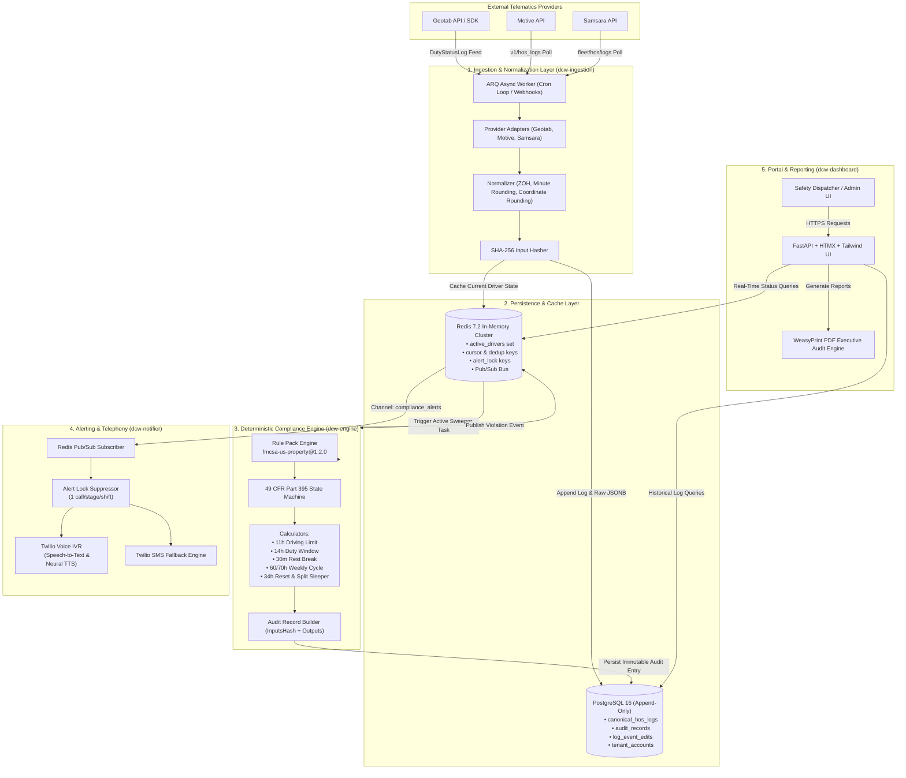

Here is the complete, updated architecture diagram and data-flow breakdown without the SaaS Tier Enforcement and Billing Layer.

---

## 1. End-to-End System Architecture Diagram

---

## 2. Comprehensive Layer Breakdown

### Layer 1: Ingestion & Telematics Normalization (`dcw-ingestion`)

* **Polling & Webhook Ingestion**: Driven by `ARQ` background cron tasks running every 2 minutes. Uses `httpx` connection pooling to fetch feeds from Geotab, Motive, and Samsara.
* **Normalization Engine**:
* Truncates sub-second microsecond noise to 1-second precision.
* Rounds GPS coordinates to 4 decimal places ($\approx 11.1\text{m}$ precision).
* Applies **Zero-Order Hold (ZOH)** forward filling across gaps.
* Overrides ambiguous off-duty statuses to `DRIVING` if vehicle speed $> 5\text{ mph}$ (ECM precedence).

* **SHA-256 Hashing**: Computes a canonical SHA-256 digest over normalized inputs to guarantee input integrity before writing to PostgreSQL.

---

### Layer 2: Persistence & Caching

* **PostgreSQL 16 (Append-Only Event Store)**:
* `canonical_hos_logs`: Immutable, sequence-versioned log stream. Hard triggers block SQL `UPDATE` and `DELETE` commands.
* `audit_records`: Cryptographically linked audit logs storing `inputs_hash`, `rule_pack_version`, evaluation timestamps, and calculated output states.
* `log_event_edits`: Full FMCSA § 395 audit trail tracking editor identity, justification comments, and driver sign-off status.

* **Redis 7.2 (In-Memory Accelerator)**:
* Stores active driver status sets (`set:active_drivers`) for sub-millisecond sweeper scans.
* Tracks cursor tokens (`cursor:geotab:{tenant_id}`) for stateless polling resume.
* Manages idempotency alert locks (`alert_lock:{tenant}:{driver}:{shift}:{rule}:{stage}`).
* Acts as the Pub/Sub messaging bus for real-time compliance events.

---

### Layer 3: Deterministic Compliance Engine (`dcw-engine`)

* **Stateless Evaluation**: Accepts a driver's historical timeline and computes compliance outputs in $<20\text{ms}$ using pure state-machine logic (0% probabilistic or LLM scoring).
* **Rule Pack Versioning**: Bound to explicit SemVer releases (e.g., `fmcsa-us-property@1.2.0`).
* **Rule Calculators**:
1. **11-Hour Driving Limit**: Countdown triggered after 10 consecutive hours off-duty.
2. **14-Hour Duty Window**: Rigid shift window tracking continuous elapsed time.
3. **30-Minute Rest Break**: Triggered when 8 cumulative hours of driving elapse without a 30-minute rest block.
4. **60/70-Hour Weekly Cycle**: Rolling 7- or 8-day cumulative duty aggregation.
5. **34-Hour Restart & Split Sleeper**: Resets rolling cycle counters and pauses 14-hour clocks during qualifying paired rest periods.

---

### Layer 4: Alerting & Telephony (`dcw-notifier`)

* **Pub/Sub Handler**: Listens to `channel:compliance_alerts` on Redis.
* **Alert Lock Suppression**: Verifies that an alert key does not already exist before placing calls, preventing duplicate phone calls during periodic sweeper loops.
* **Multi-Language Speech IVR (Twilio)**:
* Initiates automated phone calls for high-severity warnings.
* Uses Twilio `<Gather input="speech">` to detect driver language preference (`English`, `Español`, `Français`).
* Delivers localized warnings using **Amazon Polly Neural TTS**.

* **SMS Fallback Engine**: Sends immediate text messages to dispatchers and safety officers if phone calls are unacknowledged.

---

### Layer 5: Presentation & Dashboard (`dcw-dashboard`)

* **FastAPI + HTMX + TailwindCSS**: Server-driven UI providing high-visibility live status boards without complex JavaScript frameworks.
* **Executive PDF Audit Generator (WeasyPrint)**: Converts HTML/Tailwind templates into daily PDF compliance reports for safety managers.